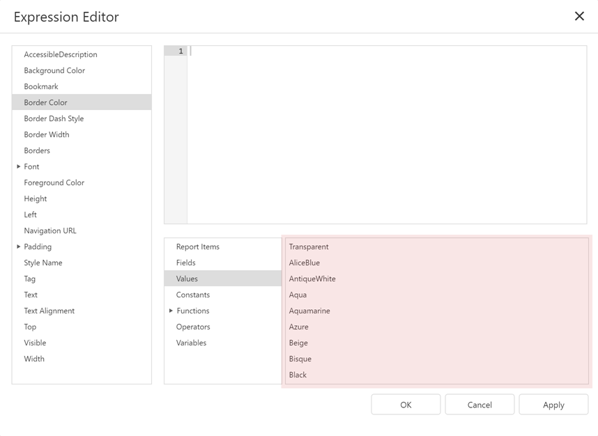

# Expression Language

This section describes the report-specific expression syntax.

## Expression Syntax

An expression is a text string that specifies what data to take and how to process it to obtain a value. For instance, the following expression returns an integer value of `5`:

`
3 + 2
`

An expression string can consist of multiple lines that include constants, operators, function calls, fields or parameters, report items, and comments:

```
/*
This expression is set for the Visible property of a control
to show/hide the control based on the ShowTotalAmount parameter value.
*/

Iif (
  ?ShowTotalAmount == True,
  True,
  False
  )
```

## Constants

* String constants  
  Wrap string constants in apostrophes. If a string contains an apostrophe, double the apostrophe.
  ```
  [Country] == 'France'
  [Name] == 'O''Neil'
  ```

* Date-time constants  
  Wrap date-time constants in '#'.
  ```
  [OrderDate] &gt;= #2018-03-22 13:18:51.94944#
  ```

* True  
  The Boolean True value.
  ```
  [InStock] == True
  ```

* False  
  The Boolean False value.
  ```
  [InStock] == False
  ```
 
* Enumeration  
  Specify an enumeration value by its underlying integer value.
  ```
  [Status] == 1
  ```

* Guid  
  Wrap a Guid constant in curly braces. Use Guid constants in a relational operation with equality or inequality operators only.
  ```
  [OrderID] == {513724e5-17b7-4ec6-abc4-0eae12c72c1f}
  ```
 
* Numeric  
  Specify numeric constant types in a string form by suffixes:
  * Int32 (int) - _1_
  * Int16 (short) - _1s_
  * Byte (byte) - _1b_
  * Double (double) - _1.0_
  * Single (float) - _1.0f_
  * Decimal (decimal) - _1.0m_

  | Value | Suffix | Example |
  | --- | --- | --- |
  | 32-bit integer | No suffix | [CategoryID] == _1_ |
  | 16-bit integer | s | [CategoryID] == _1s_ |
  | Byte | b | [CategoryID] == _1b_ |
  | Double-precision floating-point number | No suffix | [Length] == _1.0_ |
  | Single-precision floating-point number | f | [Length] == _1.0f_ |
  | Decimal floating-point number | m | [Price] == _25.0m_ |

* ?  
  A null reference that does not refer to any object.  
  We recommend that you use the **IsNull** unary operator (for example, "[Region] is null") or the **IsNull** logical function (for example, "IsNull([Region])") instead of **?**.
  ```
  [Region] != ?
  ```

## Operators

* \+  
  Adds the value of one numeric expression to another or concatenates two strings.
  ```
  [UnitPrice] + 4
  [FirstName] + ' ' + [LastName]
  ```
 
* \-  
  Finds the difference between two operands.
  ```
  [Price1] - [Price2]
  ```

* \*  
  Multiplies the value of two operands.
  ```
  [Quantity] * [UnitPrice]
  ```

* /  
  Divides the first operand by the second.
  ```
  [Quantity] / 2
  ```

* %  
  Divides one numeric operand by the other and returns the remainder (modulus).
  ```
  [Quantity] % 3
  ```

* |  
  Performs a bitwise inclusive OR operation on two numeric expressions. Compares each bit of its first operand to the corresponding bit of its second operand. If either bit is 1, the corresponding resulting bit is set to 1. Otherwise, the corresponding resulting bit is set to 0.
  ```
  [Number] | [Number]
  ```

* &amp;  
  The bitwise AND operator. Compares each bit of its first operand to the corresponding bit of its second operand. If the two bits are 1, the corresponding resulting bit is set to 1. Otherwise, the corresponding resulting bit is set to 0.
  ```
  [Number] &amp; 10
  ```

* ^  
  Performs a bitwise exclusive OR operation on two numeric expressions.
  ```
  [Number] ^ [Number]
  ```

* ==  
  Returns **True** if both operands are equal; otherwise, it returns **False**.
  ```
  [Quantity] == 10
  ```

* !=  
  Returns **True** if the operands are not equal; otherwise, it returns **False**.
  ```
  [Country] != 'France'
  ```

* &lt;  
  Less than operator. Used to compare expressions.
  ```
  [UnitPrice] &lt; 20
  ```

* &lt;=  
  Less than or equal to operator. Used to compare expressions.
  ```
  [UnitPrice] &lt;= 20
  ```

* &gt;=  
  Greater than or equal to operator. Used to compare expressions.
  ```
  [UnitPrice] &gt;= 30
  ```

* &gt;  
  Greater than operator. Used to compare expressions.
  ```
  [UnitPrice] &gt; 30
  ```

* In (,,,)  
  Tests for the existence of a property in an object.
  ```
  [Country] In ('USA', 'UK', 'Italy')
  ```

* Between (,)  
  Specifies a range to test. Returns **True** if a value is greater than or equal to the first operand and less than or equal to the second operand.
  ```
  [Quantity] Between (10, 20)
  ```

* And (&amp;&amp;)  
  Performs a logical conjunction on two Boolean expressions.
  ```
  [InStock] And ([ExtendedPrice]> 100)
  [InStock] &amp;&amp; ([ExtendedPrice]> 100)
  ```

* Or (||)  
  Performs a logical disjunction on two Boolean expressions.
  ```
  [Country]=='USA' Or [Country]=='UK'
  [Country]=='USA' \|| [Country]=='UK'
  ```

* ~  
  Performs a bitwise negation on a numeric expression.
  ```
  ~[Roles] = 251
  ```

* Not (!)  
  Performs a logical negation on a Boolean expression.
  ```
  Not [InStock]
  ![InStock]
  ```

* +  
  Returns a numeric expression's value (a unary operator).
  ```
  +[Value] = 10
  ```

* -  
  Returns the negative of a numeric expression's value (a unary operator).
  ```
  -[Value] = 20
  ```

* Is Null  
  Returns **True** if an expression is a null reference (one that does not refer to any object).
  ```
  [Region] is null
  ```

## Operator Precedence

When an expression contains multiple operators, these operators are evaluated in the following sequence:

* Literal values
* Parameters
* Identifiers
* OR (left-associative)
* AND (left-associative)
* The '.' relationship qualifier (left-associative)
* ==, !=
* &lt;, &gt;, &lt;=, &gt;=
* -, + (left-associative)
* *, /, % (left-associative)
* NOT
* Unary -
* In
* Iif
* Trim(), Len(), Substring(), IsNull()
* '[]' (for set-restriction)
* '()'

Group elements with parentheses to change operator precedence. For instance, operators are applied in the default order in the following expression:

`Accounts[Amount == 2 + 48 * 2]`

In the next expression, the addition operation is applied first, because its associated elements are grouped with parentheses, and the multiplication operation is applied last.

`Accounts[Amount == (2 + 48) * 2]`

## Functions

The expression language includes a set of functions that extend an expression's capabilities:

* Logical functions
* Date and time functions
* Math functions
* String functions
* Functions for expression bindings and calculated fields
* Functions for stored procedures
* Functions for the Summary Expression Editor

You can also implement custom functions.

See the following topic for a complete list of functions that are available in expressions: [Functions in Expressions](functions-in-expressions.md).

## Case Sensitivity

Operators are case-insensitive. Case sensitivity of values can depend on the data source. For instance, SQL Server Express 2005 is configured as case-insensitive. In this case, the following [filter expression](../shape-report-data/filter-data/filter-data-at-the-report-level.md) always evaluates to **True**:

`Lower(Name) == Upper(Name)`

## Escape Keywords

You can mark a keyword-like field name with the **@** escape character. In the expression below, the **CriteriaOperator.Parse** method interprets `@Or` as a field named **Or**, not the logical operator OR.

`@Or = 'value'`

## Escape Characters

Use a backslash (`\`) as an escape character for characters in an expression, as shown below:

`\[`

`\\`

`\'`
 
Use an apostrophe (`'`) as an escape character for string literals:

`'A parameter''s value is:' + ?parameter1`

## Data Fields and Calculated Fields

Enclose a data field or calculated field's name in square brackets (```[``` and ```]```):

```
/*
This expression is set for a control's Text property
to bind the control to the UnitPrice data field.
*/
[UnitPrice]
```

Ensure that the field with the specified name exists in the report's data source and data member.

You can refer to data fields from a data member that is not specified as the report's data member (only the first record is returned):

```
/*
This expression is set for a control's Text property
to bind the control to the UnitPrice data field from the Products data member
(the report is not bound to Products).
*/
[Products].[UnitPrice]
```

## Report Parameters

Use the following syntax to insert [report parameters](../use-report-parameters.md) in an expression:

- Type a question mark before a parameter's name.  

  `?parameter1`

- (*Obsolete*) Use the "Parameters." prefix in front of a report parameter's name.  

  `[Parameters.parameter1]`

## Enumerations

Do one of the following to assign an enumeration value to a property:

- Specify an enumeration value by its underlying integer value.

  `[Borders] = 1`

- The **Expression Editor** can help you specify a string value for built-in enumerations:

  

## Comments

The expression language supports comments. For example:

```
/*
This is a comment within an expression.
*/
```

Comments start with the ```/*``` sequence and end at the matching ```*/``` sequence.
