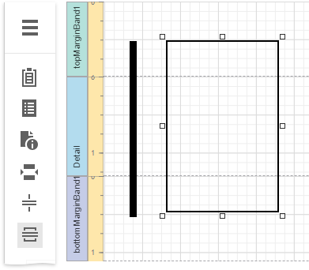
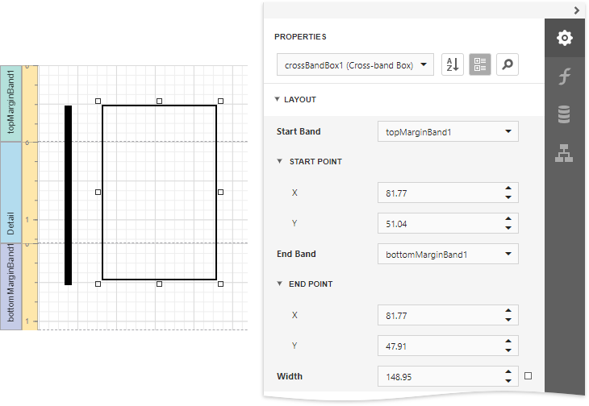
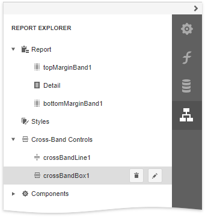

# Draw Cross-Band Lines and Boxes

Cross-band controls allow you to draw lines and rectangles through several [report bands](../../introduction-to-banded-reports.md).

The Report Designer provides the following two cross-band controls:

* The **Cross-Band Line** control draws vertical lines that can span multiple report bands. You can use this control to emphasize a report area that consists of different bands.   
* The  **Cross-Band Box** control draws rectangles through several report bands. You can use this control to encompass a report section that includes multiple band areas.

To add a cross-band control to a report, select the corresponding item in the [Toolbox](../../report-designer-tools/toolbox.md) and draw a rectangle across required bands.

The following properties define a cross-band control's location in a report:

* **Start Band** - determines the band from which the control starts to draw;
* **Start Point** - specifies the exact coordinates (measured in [report units](../../configure-design-settings/change-a-report-measurement-units.md)) within the start band where the control starts to draw;
* **End Band** -  determines the band where the cross-band control stops to draw;
* **End Point** - specifies the exact coordinates (measured in [report units](../../configure-design-settings/change-a-report-measurement-units.md)) within the end band where the control finishes to draw.

The following image illustrates how the [Report Explorer](../../report-designer-tools/ui-panels/report-explorer.md) reflects cross-band controls:

