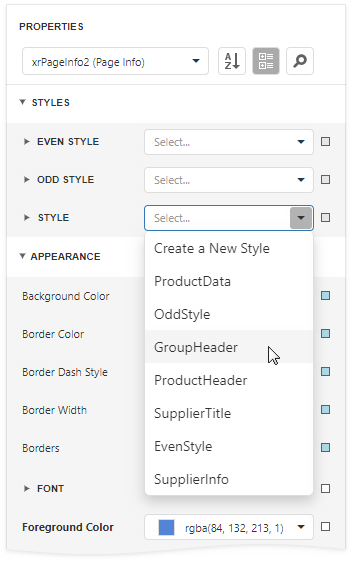
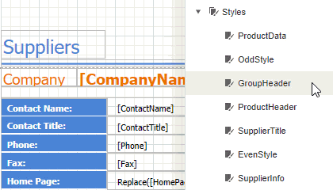

# Apply Styles to Report Elements

Select a control and switch to the **Properties** window. Expand the **Styles** group and set the **Style** property to the style name.

As an alternative, you can drag a style from the [Report Explorer](../../report-designer-tools/ui-panels/report-explorer.md) onto a control.

