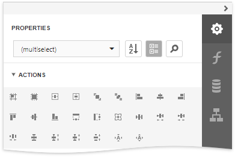

# Arrange Report Controls

You can align report controls to each other, change the report element's size, change the stacked elements' order, and so on. Select a report control or multiple controls and choose an appropriate command in the **Actions** category.

The design surface displays a visual grid that allows you to determine elements' size and location in a report. Use the **Snap Grid Size** property to customize the grid's size.

										
You can use the **Align to Grid** button to align the selected controls to the grid's cells.

		
The Report Designer displays snap lines when you move or resize report controls. These lines appear around the report controls and indicate the distance to other report elements (controls and bands).

				
To avoid snapping controls, hold down ALT if you move or resize controls using the mouse.
		
