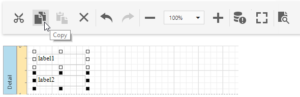
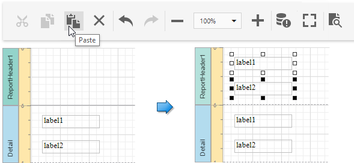

# Copy Report Controls

You can use the [Main Toolbar](../../report-designer-tools/toolbar.md)'s commands or keyboard shortcuts to clone an existing report control. A cloned control has the same settings as the initial control.

[Select report controls](select-report-elements-and-access-their-settings.md) and click the **Copy** button or press CTRL + C to copy report controls to the clipboard.

Select a new container or band and click the **Paste** button or press CTRL+V to paste these controls.

