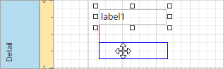
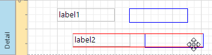
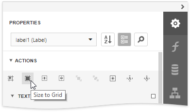
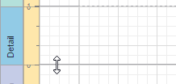
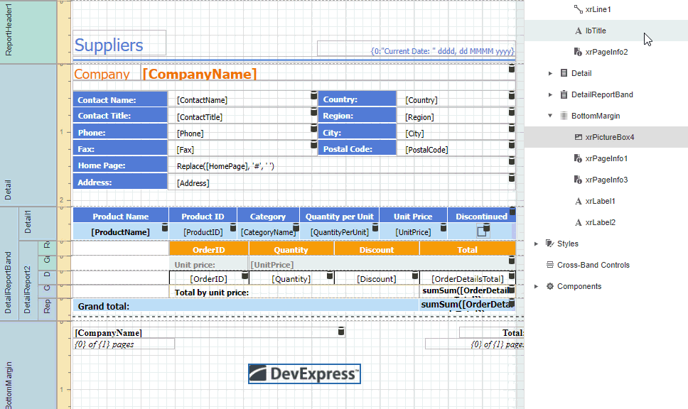

# Move and Resize Report Elements

You can use the mouse or keyboard to move a report control to a new location.

You can also [select multiple controls](select-report-elements-and-access-their-settings.md) and move them in the same way as individual report controls.

Select a control and then drag a rectangle drawn on its edge or corner to resize it.

Use the **Size to Grid** button to resize a control to the report's **Snap Grid**.

Drag a band's header strip to resize the band.

You can also use the [Report Explorer](../../report-designer-tools/ui-panels/report-explorer.md) to move a control to other bands (except **Detail Report Band**), or into a **Panel** or **Table Cell** controls. Select a control and drag it within the Report Explorer. The drop targets are highlighted when you drag the control over them.

> [!NOTE]
> You can drag the **Table Of Contents** only to the **Report Header Band** and **Report Footer Band**.

See [Arrange Report Controls](arrange-report-controls.md) for information about tools that help you align report controls to each other and layout edges.
