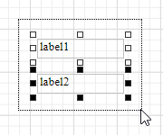
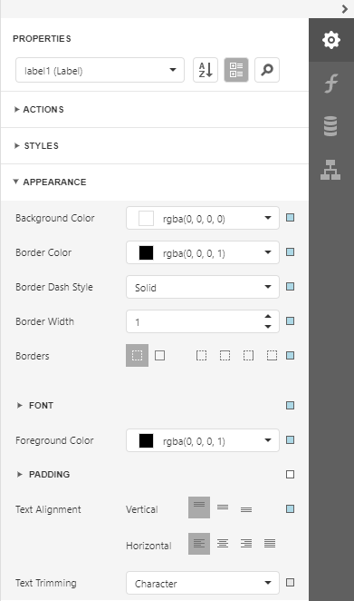
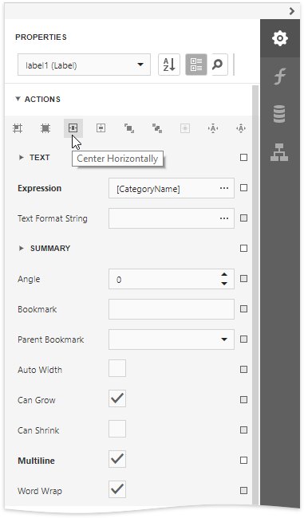

# Select Report Elements and Access Their Settings

You can click a report control or band to select it. 

Do one of the following to select multiple report controls:
* Press and hold the CTRL key and click the controls.
* Click an empty place on a report's surface and draw a rectangle around the controls.
    

Click the gray area around the design surface to select a report.

You can use the [Properties panel](../../report-designer-tools/ui-panels/properties-panel.md) to access the whole set of settings that the selected element supports.

The **Actions** category contains the most commonly used element properties, as well as alignment and positioning commands.

