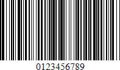
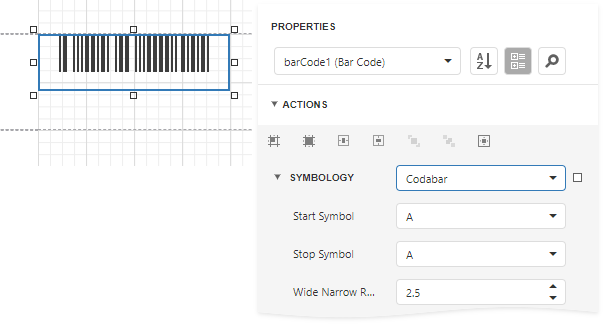

# Codabar

The **Codabar** is a discrete, self-checking symbology that may encode **16** different characters, plus an additional **4** start/stop characters. This symbology is used by U.S. blood banks, photo labs, and on FedEx air bills.

## Add the Barcode to a Report

1. Drag the **Barcode** item from the report controls toolbox tab and drop it onto the report. 

    

2. Set the control’s **Symbology** property to **Codabar**. 

    

3. Specify [common](add-bar-codes-to-a-report.md) barcode properties and properties [specific](#specific-properties) to **Codebar**.

## Specific Properties

In the [property grid](../../report-designer-tools/ui-panels/properties-panel.md), expand the **Symbology** list and specify the following properties specific to **Codabar**:

* **StartSymbol**

    Gets or sets the first (start) symbol used to code the barcode's structure.

* **StopSymbol**

    Gets or sets the last (stop) symbol used to code the barcode's structure.

* **Wide Narrow Ratio**

    Specifies the density of a barcode's bars.