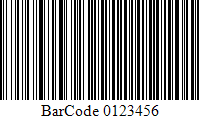

# Code 128

**Code 128** is a very effective, high-density symbology which permits the encoding of alphanumeric data. The symbology includes a checksum digit for verification, and the bar code can also be verified character-by-character, allowing the parity of each data byte to be verified.

This symbology has been widely implemented in many applications where a relatively large amount of data must be encoded in a relatively small amount of space. Its specific structure also allows numerical data to be effectively encoded at double-density.

## Add the Bar Code to a Report

1. Drag the **Bar Code** item from the report controls toolbox tab and drop it onto the report. 

    

2. Set the control’s **Symbology** property to **Code128**. 

    

3. Specify [common](add-bar-codes-to-a-report.md) barcode properties and properties [specific](#specific-properties) to **Code 128**.

## Specific Properties

In the [property grid](../../report-designer-tools/ui-panels/properties-panel.md), expand the **Symbology** list and specify the following properties specific to **Code 128**:

* **Character Set**
	
	Specifies the set of symbols which can be used when setting the bar code's text.