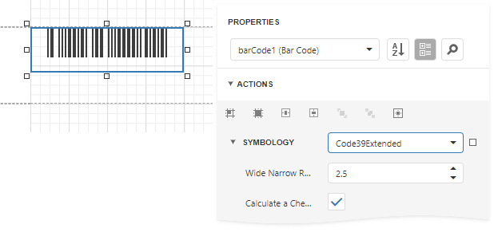

# Code 39 Extended

Using **Code 39**'s "Full ASCII Mode", it is possible to encode all **128** ASCII characters. This is accomplished by using the (**$**), (**/**), (**%**), and (**+**) symbols as "shift" characters. These characters combined with the single character that follows indicate which Full ASCII character is to be used.

## Add the Barcode to a Report

1. Drag the **Barcode** item from the report controls toolbox tab and drop it onto the report. 

    

2. Set the control’s **Symbology** property to **Code39Extended**. 

    

3. Specify [common](add-bar-codes-to-a-report.md) barcode properties and properties [specific](#specific-properties) to **Code 39 Extended**.

## Specific Properties

In the [property grid](../../report-designer-tools/ui-panels/properties-panel.md), expand the **Symbology** list and specify the following properties specific to **Code 39 Extended**:

* **Calculate a Checksum**

    Specifies whether to calculate a checksum for the barcode.

* **Wide Narrow Ratio**

    Specifies the density of a barcode's bars.

The **Code 39 Extended** barcode, as opposed to [Code 39](code-39-usd-3.md), automatically replaces all necessary characters with special symbols, when required. This means that you do not need to do this manually, otherwise, the result will be incorrect.

For example, if you want to insert a "TAB" character into a barcode's text, use "\t", which will be replaced by "$I" for coding, and then into "TAB" after scanning:

| Property | Value |
|---|---|
| Barcode's text: | "12345\t678" |
| Coded text: | "12345$I678" |
| Scanned text: | "12345[TAB]678" |

The checksum is not considered to be part of a barcode's text and checksum characters are never replaced. When the barcode's **Show Text** and **Calculate a Checksum** properties are enabled, the barcode will not display a checksum character. This is required to avoid mistakenly treating a checksum as part of barcode text.