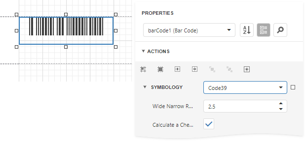

# Code 39 (USD-3)

**Code 39**, the first alpha-numeric symbology to be developed, is still widely used, particularly in non-retail environments. It is the standard barcode used by the United States Department of Defense, and is also used by the Health Industry Barcode Council (HIBCC). **Code 39** is also known as "**3 of 9 Code**" and "**USD-3**".

## Add the Barcode to a Report

1. Drag the **Barcode** item from the report controls toolbox tab and drop it onto the report. 

    

2. Set the control’s **Symbology** property to **Code39**. 

    

3. Specify [common](add-bar-codes-to-a-report.md) barcode properties and properties [specific](#specific-properties) to **Code 39**.

## Specific Properties

In the [property grid](../../report-designer-tools/ui-panels/properties-panel.md), expand the **Symbology** list and specify the following properties specific to **Code 39**:

* **Calculate a Checksum**

    Specifies whether to calculate a checksum for the barcode.

* **Wide Narrow Ratio**

    Specifies the density of a barcode's bars.