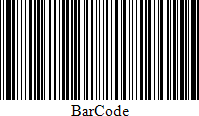
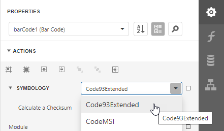

# Code 93 Extended

Using **Code 93**'s "Full ASCII Mode", it is possible to encode all **128** ASCII characters. This is accomplished by using the (**$**), (**/**), (**%**), and (**&#0043;**) symbols as "shift" characters. These characters combined with the single character that follows indicate which Full ASCII character is to be used.

## Add the Barcode to a Report

1. Drag the **Barcode** item from the report controls toolbox tab and drop it onto the report. 

    

2. Set the control’s **Symbology** property to **Code93Extended**. 

    

3. Specify [common](add-bar-codes-to-a-report.md) barcode properties and properties [specific](#specific-properties) to **Code 93 Extended**.

## Specific Properties

In the [property grid](../../report-designer-tools/ui-panels/properties-panel.md), expand the **Symbology** list and specify the following properties specific to **Code 93 Extended**:

* **Calculate a Checksum**

    Specifies whether to calculate a checksum for the barcode.

    > [!NOTE]
	> A checksum of a **Code 93 Extended** barcode can contain characters that are not supported by this barcode symbology. For this reason, the checksum is not included in the **Code 93 Extended** barcode's displayed text.