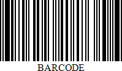
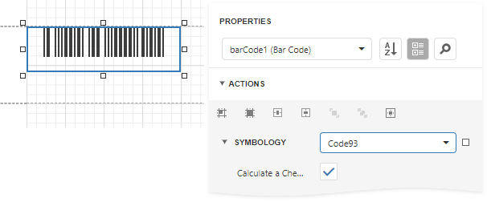

# Code 93

**Code 93** was designed to supplement and improve upon **Code 39**.

**Code 93** is similar in that, like **Code 39**, can represent the full ASCII character set by using combinations of **2** characters. It differs in that **Code 93** is a continuous symbology and produces denser code. It also encodes **47** characters (compared to **Code 39**'s **43** characters).

## Add the Barcode to a Report

1. Drag the **Barcode** item from the report controls toolbox tab and drop it onto the report. 

    

2. Set the control’s **Symbology** property to **Code93**. 

    

3. Specify [common](add-bar-codes-to-a-report.md) barcode properties and properties [specific](#specific-properties) to **Code 93**.

## Specific Properties

In the [property grid](../../report-designer-tools/ui-panels/properties-panel.md), expand the **Symbology** list and specify the following properties specific to **Code 93**:

* **Calculate a Checksum**

    Specifies whether to calculate a checksum for the barcode.

    > [!NOTE]
	> A checksum of a **Code 93** barcode can contain characters that are not supported by this barcode symbology. For this reason, the checksum is not included in the **Code 93** barcode's displayed text.