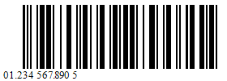
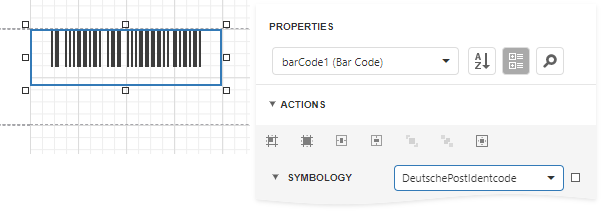

# Deutsche Post Identcode

The *Deutsche Post Identcode* symbology, also referred to as Deutsche Post AG IdentCode, German Postal 2 of 5 IdentCode, Deutsche Frachtpost IdentCode, or Deutsche Post AG (DHL), is used by German Post (Deutsche Post AG).

The barcode contains a tracking number that identifies a customer (sender) and a mail item. A value that the barcode encodes should consist of 11 or 12 digits:

* 2 digits for a distribution center ID;
* 3 digits for a customer ID;
* 6 digits for a mailing number;
* 1 digit for a checksum (optional).

When you specify 11 digits, the barcode generates a checksum digit automatically. If you add a checksum digit, the barcode ignores this digit and also generates it automatically to ensure the encoded value is valid.

## Add the Barcode to a Report

1. Drag the **Barcode** item from the report controls toolbox tab and drop it onto the report. 

    

2. Set the control’s **Symbology** property to **DeutschePostIdentcode**. 

    

3. Specify [common](add-bar-codes-to-a-report.md) barcode properties.