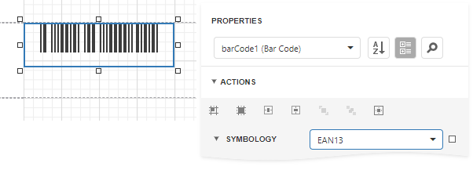

# EAN 13

**EAN-13**, based upon the **UPC-A** standard, was implemented by the International Article Numbering Association (EAN) in Europe. At present, the **GS1** organization is responsible for the maintenance of barcode standards.

The **EAN-13** barcode contains **13** digits, no letters or other characters. The first two or three digits represent the country. The leading zero actually signifies the USA, and **UPC-A** coding. The last digit is the "check digit", the checksum. The check digit is calculated using the first twelve figures when the barcode is constructed. So, for the correct **EAN-13** code, you should specify only the first **12** digits.

The recommended dimensions are shown in the following image. The standard allows magnification up to **200**%, and reduction of up to **80**% of the recommended size.

There should be two quiet zones before and after the barcode. They provide reliable operation of the barcode scanner. The quiet zone recommended length is **3.63** mm for the left zone and **2.31** mm for the right zone.

## Add the Barcode to a Report

1. Drag the **Barcode** item from the report controls toolbox tab and drop it onto the report. 

    

2. Set the control’s **Symbology** property to **EAN13**. 

    

3. Specify [common](add-bar-codes-to-a-report.md) barcode properties.
