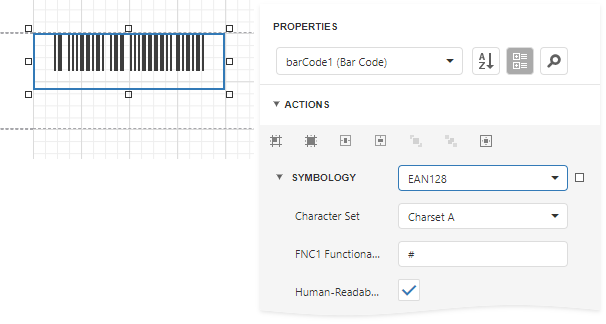

# GS1-128 - EAN-128 (UCC)

**GS1-128** (**EAN-128**) was developed to provide a worldwide format and standard for exchanging common data between companies.

While other barcodes simply encode data with no respect for what the data represents, **GS1-128** encodes data and encodes what that data represents.

## Add the Barcode to a Report

1. Drag the **Barcode** item from the report controls toolbox tab and drop it onto the report. 

    

2. Set the control’s **Symbology** property to **EAN128**. 

    

3. Specify [common](add-bar-codes-to-a-report.md) barcode properties and properties [specific](#specific-properties) to **EAN 128**.

## Specific Properties

In the [property grid](../../report-designer-tools/ui-panels/properties-panel.md), expand the **Symbology** list and specify the following properties specific to **EAN 128**:

* **Character Set**
	
	Specifies the set of symbols which can be used when setting the barcode's text.

* **FNC1 Functional Character**
	
	Specifies the symbol (or set of symbols) in the barcode text that will be replaced with the **FNC1** functional character when the barcode's bars are drawn.

* **Human-Readable Text**

    Specifies whether or not parentheses should be included in the barcode's text to improve the readability of the barcode's text.