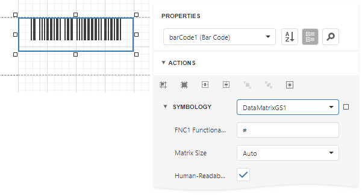

# GS1 - Data Matrix

The **GS1 Data Matrix** uses a special start combination to differentiate the **GS1 DataMatrix** symbol from other **Data Matrix ECC 200** symbols. This is achieved by using the **Function 1 Symbol Character** (**FNC1**) in the first position of the encoded data. It enables scanners to process the information according to the **GS1 System Rules**.

## Add the Barcode to a Report

1. Drag the **Barcode** item from the report controls toolbox tab and drop it onto the report. 

    

2. Set the control’s **Symbology** property to **DataMatrixGS1**. 

    

3. Specify [common](add-bar-codes-to-a-report.md) barcode properties and properties [specific](#specific-properties) to **GS1 Data Matrix**.

## Specific Properties

In the [property grid](../../report-designer-tools/ui-panels/properties-panel.md), expand the **Symbology** list and specify the following properties specific to **GS1 Data Matrix**:

* **FNC1 Functional Character**
	
	Specifies the symbol (or set of symbols) in the barcode text that will be replaced with the **FNC1** functional character when the barcode's bars are drawn.

* **Human-Readable Text**

    Specifies whether or not parentheses should be included in the barcode's text to improve the readability of the barcode's text.

* **Matrix Size**

	Specifies the barcode matrix size.