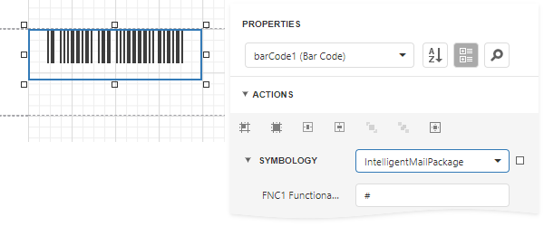

# Intelligent Mail Package

The **Intelligent Mail Package Barcode** (**IMPB**) was developed for the use on mail in the United States. Barcodes of this symbology are used only for packages as opposed to [Intelligent Mail](intelligent-mail.md) barcodes, which are used for postcards, letters, and flats.

This barcode is capable of encoding package tracking information required for more efficient sorting and delivering of packages with the capability of piece-level tracking.

## Add the Barcode to a Report

1. Drag the **Barcode** item from the report controls toolbox tab and drop it onto the report. 

    

2. Set the control’s **Symbology** property to **IntelligentMailPackage**. 

    

3. Specify [common](add-bar-codes-to-a-report.md) barcode properties and properties [specific](#specific-properties) to **Intelligent Mail Package**.

## Specific Properties

In the [property grid](../../report-designer-tools/ui-panels/properties-panel.md), expand the **Symbology** list and specify the following property specific to **Intelligent Mail Package**:

* **FNC1 Functional Character**
	
	Specifies the symbol (or set of symbols) in the barcode text that will be replaced with the **FNC1** functional character when the barcode's bars are drawn.