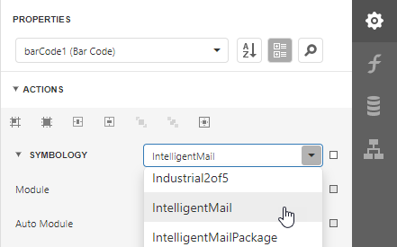

# Intelligent Mail

The **Intelligent Mail** (**IM**) code is a **65**-bar code for use on mail in the United States. This bar code is intended to provide greater information and functionality than its predecessors POSTNET and PLANET.

The **Intelligent Mail** bar code has also been referred to as **One Code Solution** and **4-State Customer** bar code abbreviated **4CB**, **4-CB** or **USPS4CB**.

## Add the Bar Code to a Report

1. Drag the **Bar Code** item from the report controls toolbox tab and drop it onto the report. 

    

2. Set the control’s **Symbology** property to **IntelligentMail**. 

    

3. Specify [common](add-bar-codes-to-a-report.md) barcode properties.