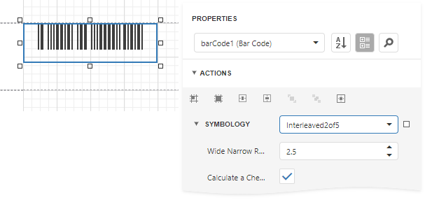

# Interleaved 2 of 5

**Interleaved 2 of 5** is a higher-density numerical barcode based upon the **Standard 2 of 5** symbology. It is used primarily in the distribution and warehouse industry.

## Add the Barcode to a Report

1. Drag the **Barcode** item from the report controls toolbox tab and drop it onto the report. 

    

2. Set the control’s **Symbology** property to **Interleaved2of5**. 

    

3. Specify [common](add-bar-codes-to-a-report.md) barcode properties and properties [specific](#specific-properties) to **Interleaved 2 of 5**.

## Specific Properties

In the [property grid](../../report-designer-tools/ui-panels/properties-panel.md), expand the **Symbology** list and specify the following properties specific to **Interleaved 2 of 5**:

* **Calculate a Checksum**

    Specifies whether to calculate a checksum for the barcode.

* **Wide Narrow Ratio**

    Specifies the density of a barcode's bars.