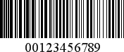
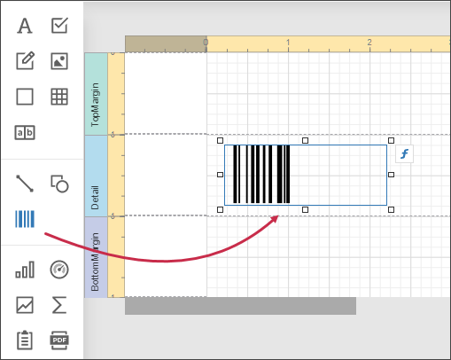
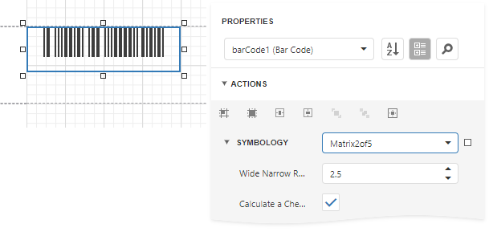

# Matrix 2 of 5

**Matrix 2 of 5** is a linear one-dimensional barcode. **Matrix 2 of 5** is a self-checking numerical-only barcode.

Unlike the **Interleaved 2 of 5**, all of the information is encoded in the bars; the spaces are of a fixed width and used only to separate the bars. **Matrix 2 of 5** is used primarily for warehouse sorting, photo finishing, and airline ticket marking.

## Add the Barcode to a Report

1. Drag the **Barcode** item from the report controls toolbox tab and drop it onto the report. 

    

2. Set the control’s **Symbology** property to **Matrix2of5**. 

    

3. Specify [common](add-bar-codes-to-a-report.md) barcode properties and properties [specific](#specific-properties) to **Matrix 2 of 5**.

## Specific Properties

In the [property grid](../../report-designer-tools/ui-panels/properties-panel.md), expand the **Symbology** list and specify the following properties specific to **Matrix 2 of 5**:

* **Calculate a Checksum**

    Specifies whether to calculate a checksum for the barcode.

* **Wide Narrow Ratio**

    Specifies the density of a barcode's bars.