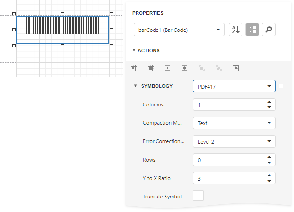

# PDF417

**PDF417** (**Portable Data File**) is a stacked linear two-dimensional barcode used in a variety of applications; primarily transport, postal, identification card and inventory management. It has spawned an Open Source decoder project together with an Open Source encoder.

The **PDF417** barcode is also called a **symbol** barcode and usually consists of **3** to **90** rows, each of which is like a small linear barcode.

## Add the Barcode to a Report

1. Drag the **Barcode** item from the report controls toolbox tab and drop it onto the report. 

    

2. Set the control’s **Symbology** property to **PDF417**. 

    

3. Specify [common](add-bar-codes-to-a-report.md) barcode properties and properties [specific](#specific-properties) to **PDF417**.

## Specific Properties

In the [property grid](../../report-designer-tools/ui-panels/properties-panel.md), expand the **Symbology** list and specify the following properties specific to **PDF417**:

* **Columns**

    Specifies the number of barcode columns, which allows you to control the logic width of the barcode.

* **Compaction Mode**

    Specifies whether textual information or a byte array should be used as the barcode's data.

* **Error Correction Level**

    Specifies the amount of redundancy built into the barcode's coding, to compensate for calculation errors.

* **Rows**

    Specifies the number of barcode rows, which allows you to control the logic height of the barcode.

* **Truncate Symbol**

    Specifies whether the special end-symbol should be appended to the barcode.

* **Y to X Ratio**

    Specifies the height-to-width ratio of a logical unit's graphic representation.