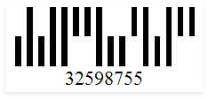
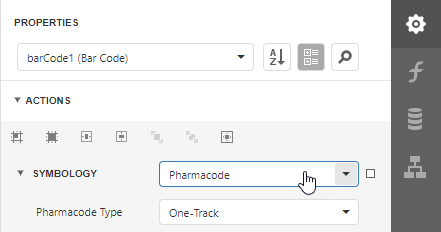

# Pharmacode

**Pharmacode** is a binary code developed by the German LAETUS GMBH company. The code is widely used in the pharmaceutical industry as a packaging control system. It can be either one-track or two-track.

| One-Track Pharmacode | Two-Track Pharmacode |
| :---: | :---: |
|  |  |

## Add the Barcode to a Report

1. Drag the **Barcode** item from the report controls toolbox tab and drop it onto the report. 

    

2. Set the control’s **Symbology** property to **Pharmacode**. 

    

3. Specify [common](add-bar-codes-to-a-report.md) barcode properties and properties [specific](#specific-properties) to **Pharmacode**.

## Specific Properties

In the [property grid](../../report-designer-tools/ui-panels/properties-panel.md), expand the **Symbology** list and specify the following property specific to **Pharmacode**:

* **Pharmacode Type**

  Specifies whether the **Pharmacode** has one or two tracks. 