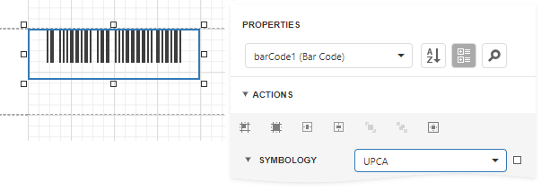

# UPC-A

The **UPC-A** barcode is by far the most common and well-known symbology, especially in the United States. A **UPC-A** barcode is the barcode you will find on virtually every consumer item on the shelves of your local supermarket, as well as books, magazines, and newspapers. It is called simply, a "UPC barcode" or "UPC Symbol."

The **UPC-A** barcode contains **12** digits, no letters or other characters. The first digit is the prefix signifying the product type. The last digit is the "check digit". The check digit is calculated using first eleven figures when the barcode is constructed. So, for the correct **UPC-A** you should specify only the first **11** digits.

The recommended dimensions are shown in the picture. The standard allows magnification up to **200**%, and reduction of up to **80**% of the recommended size.

There should be two quiet zones before and after the barcode. They provide reliable operation of the barcode scanner. The quiet zone recommended length is **2.97** mm for the barcode of standard width and height.

## Add the Barcode to a Report

1. Drag the **Barcode** item from the report controls toolbox tab and drop it onto the report. 

    

2. Set the control’s **Symbology** property to **UPCA**. 

    

3. Specify [common](add-bar-codes-to-a-report.md) barcode properties.