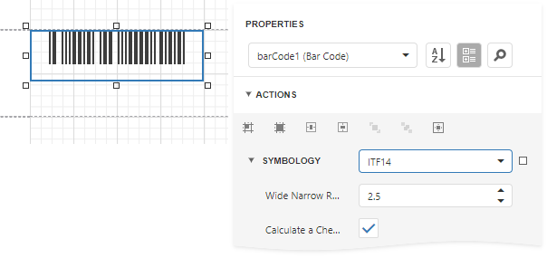

# UPC Shipping Container Symbol (ITF-14)

The **UPC Shipping Container Symbol** (**ITF-14**) bar code is used to mark packaging materials that contain products labeled with a **UPC** or **EAN** product identification number.

This bar code provides a **GS1** implementation of an **Interleaved 2 of 5** bar code for encoding a **Global Trade Item Number** (an identifier for trade items developed by **GS1**). This bar code always uses a total of **14** digits.

The thick black border around the symbol (the **Bearer Bar**) is intended to improve bar code reading reliability.

## Add the Bar Code to a Report

1. Drag the **Bar Code** item from the report controls toolbox tab and drop it onto the report. 

    

2. Set the control’s **Symbology** property to **ITF14**. 

    

3. Specify [common](add-bar-codes-to-a-report.md) barcode properties and properties [specific](#specific-properties) to **ITF14**.

## Specific Properties

In the [property grid](../../report-designer-tools/ui-panels/properties-panel.md), expand the **Symbology** list and specify the following properties specific to **ITF14**:

* **Calculate a Checksum**

    Specifies whether to calculate a checksum for the bar code.

* **Wide Narrow Ratio**

    Specifies the density of a bar code's bars.