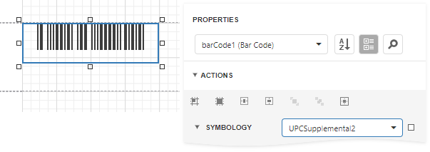

# UPC Supplemental 2

**2**-digit supplemental barcodes should only be used with magazines, newspapers and other periodicals.

The **2**-digit supplement represents the issue number of the magazine. This is useful so that the product code itself (contained in the main barcode) is constant for the magazine, so that each issue of the magazine doesn't have to have its own unique barcode. Nevertheless, the **2**-digit supplement can be used to track which issue of the magazine is being sold, for example, for sales analysis or restocking purposes.

## Add the Barcode to a Report

1. Drag the **Barcode** item from the report controls toolbox tab and drop it onto the report. 

    

2. Set the control’s **Symbology** property to **UPCSupplemental2**. 

    

3. Specify [common](add-bar-codes-to-a-report.md) barcode properties.