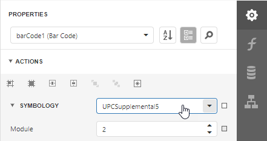

# UPC Supplemental 5

**5**-digit supplemental bar codes are used on books to indicate the suggested retail price.

## Add the Bar Code to a Report

1. Drag the **Bar Code** item from the report controls toolbox tab and drop it onto the report. 

    

2. Set the control’s **Symbology** property to **UPCSupplemental5**. 

    

3. Specify [common](add-bar-codes-to-a-report.md) barcode properties.