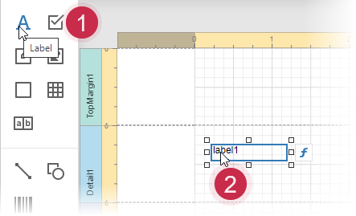
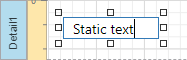
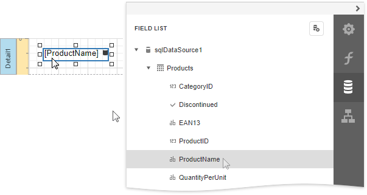
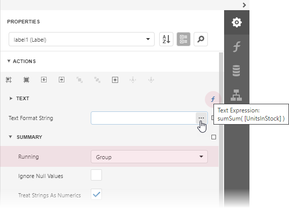
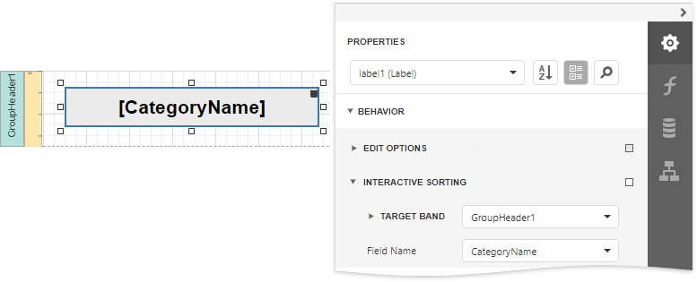

# Label

## Label Overview
The **Label** control displays plain text in a report. You can add this control by dragging the **Label** item from the [Toolbox](../../report-designer-tools/toolbox.md) onto the report's area.

You can double-click the label to invoke its in-place editor and enter the desired static text.

Press CTRL+Enter to submit text changes and exit the label's in-place editing mode.

## Bind to Data
### Display Field Values

You can [bind](../../bind-to-data/bind-controls-to-data-expression-bindings.md) the label's **Text** property to a data field obtained from a report's data source. Switch to the [Properties](../../report-designer-tools/ui-panels/properties-panel.md) panel, expand the **Actions** category and click the **Expression** property's ellipsis button. Select the required data field in the invoked **Expression Editor**.

You can use the **Expression Editor** to construct a complex binding expression involving two or more data fields.

You can also drag and drop a numeric or text field from the [Field List](../../report-designer-tools/ui-panels/field-list.md) to create a new label bound to this field.

See the [Bind Controls to Data](../../bind-to-data/bind-controls-to-data-expression-bindings.md) topic to learn more about creating data-aware controls.

The **Process Duplicates Mode**, **Process Duplicates Target** and **Process Null Values** options enable you to hide a control when a duplicated or null value appears in an assigned data source.

You can also specify output values' [format](../../shape-report-data/shape-data-expression-bindings/format-data.md) using the **Text Format String** property.

### Display Summaries

You can make the label display a [summary function's result](../../shape-report-data/shape-data-expression-bindings/calculate-a-summary.md) by setting the **Running** property to the required range and selecting the summary function in the **Expression Editor**.

## Adjust the Label Size and Content
### Static Content

You can change a label's size to fit its static text using the **Fit Bounds To Text** command in the **Actions** category:

* If the **Word Wrap** option is enabled, the command displays control content in multiple lines. It decreases the control's height and adjusts the width to fit this content.
	
	

* If the **Word Wrap** option is disabled and the control's content is partially visible, the command adjusts the control's size to display this content.
	
	

This command's result also depends on the control's **Text Alignment** and **Right To Left** settings.

Use the **Fit Text To Bounds** command to adjust the control's font size to fit its area. The **Word Wrap** option defines whether the resulting text can occupy multiple lines or should be in a single line.

These commands are not available in the following cases:

* A label's text is an empty string;
* A label's text is bound to data;
* A label's **Angle** property is specified.

### Data-Bound Labels

The **Can Grow** and **Can Shrink** properties allow you to increase or decrease the control's height according to its content in Print Preview.

| Can Grow is enabled | Can Grow is disabled |
|---|---|
|  |  |

| Can Shrink is enabled | CanShrink is disabled |
|---|---|
|  |  |

The **Auto Width** property specifies whether to adjust a data-bound label's width to its content automatically.

You can also use the opposite **Text Fit Mode** property to adjust a control's font size to fit its boundaries in Print Preview. This property is not available if the **Can Grow**, **Can Shrink** or **Auto Width** option is enabled.

| Text Fit Mode = None | Text Fit Mode = Grow Only | Text Fit Mode = Shrink Only | Text Fit Mode = Shrink And Grow |
|---|---|---|---|
|  |  |  |  |

See the [Lay out Dynamic Report Content](../../lay-out-dynamic-report-content.md) topic for more information on these options.

## Interactivity
You can enable [editing a label's content](../../provide-interactivity/edit-content-in-print-preview.md) in Print Preview by setting the **Enabled** option in the **Edit Options** section to **Yes**.

Clicking this label in a previewed document invokes the appropriate editor.

Use the label's **Interactive Sorting** option to enable sorting report data by clicking this label in Print Preview. Set the **Target Band** property to the required Group Header or Detail band, and the **Field Name** property to the corresponding data field.

Refer to [Sort a Report in Print Preview](../../provide-interactivity/sort-a-report-in-print-preview.md) for a step-by-step tutorial.
