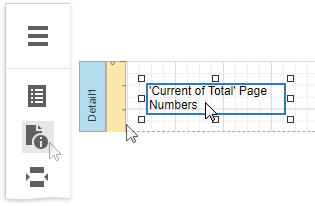
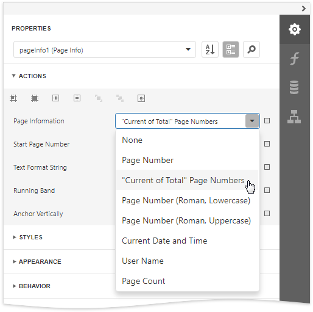
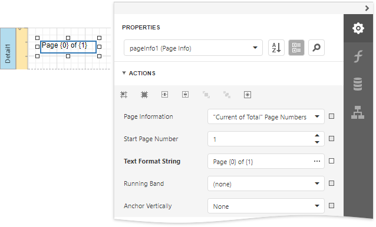

# Page Info

The **Page Info** control is used to display auxiliary information on report pages, such as date, time, page numbers or user name.

To add a new Page Info control to a report, drag the **Page Info** item from the [Toolbox](../../report-designer-tools/toolbox.md) and drop it onto the required report band.

Use the **Page Information** property to define the kind of information the control displays: page numbers, system date-time, or user name.

For examples of different uses of this control, see the corresponding tutorials:

* [Add Page Numbers](../../add-navigation/add-page-numbers.md)
* [Display the User Name in a Report](../../add-extra-information/display-the-user-name-in-a-report.md)
* [Display the Current Date and Time in a Report](../../add-extra-information/display-the-current-date-and-time-in-a-report.md)

> [!NOTE]
> Because usually this information is displayed in the Page Header/Footer and Top/Bottom Margin bands, you cannot bind the **Page Info** property to a field from a data source. So, in order to display dynamic information, use the [Label](label.md) or [Rich Text](rich-text.md) controls instead.

In addition, a format string can be applied to a control's contents. For example, you can change the control's format to **Page {0} of {1}** using the **Text Format String** property.

When a report contains at least one [group](../../shape-report-data/group-and-sort-data/group-data.md), you can specify individual page numbers for report groups by setting the **Running Band** property to the name of the required group.