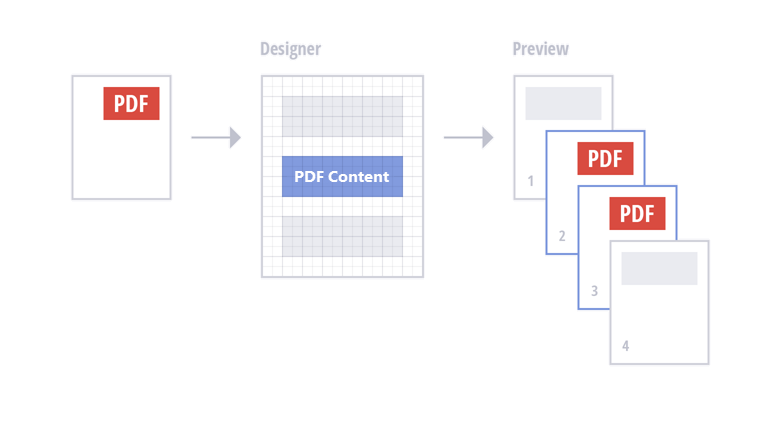
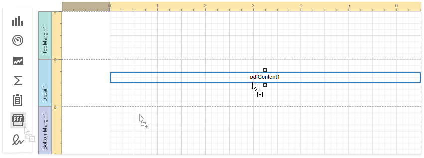
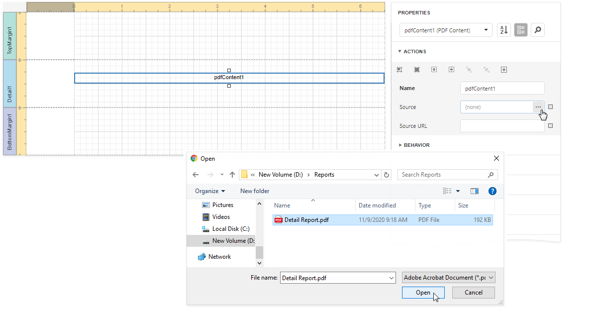
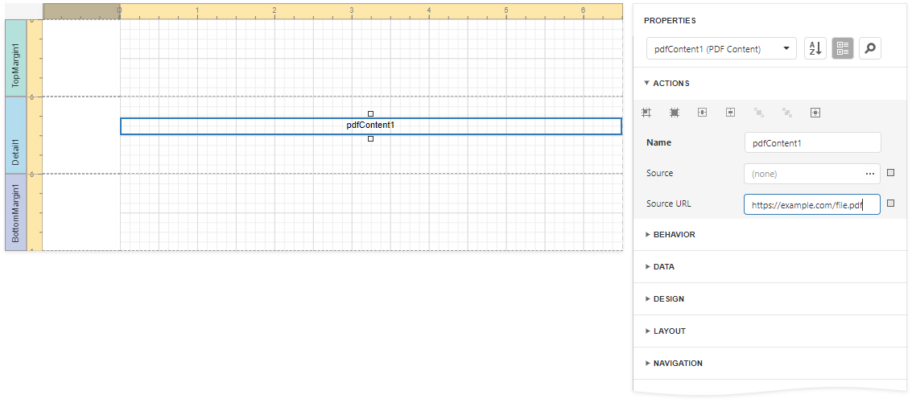
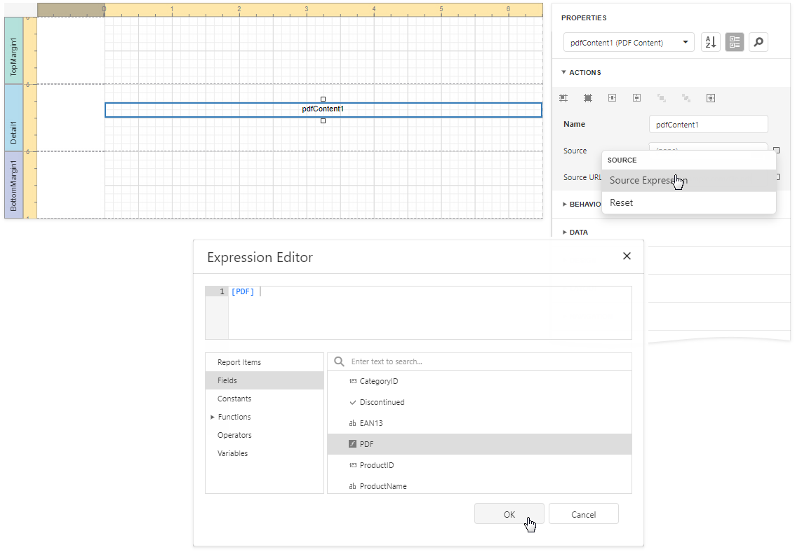
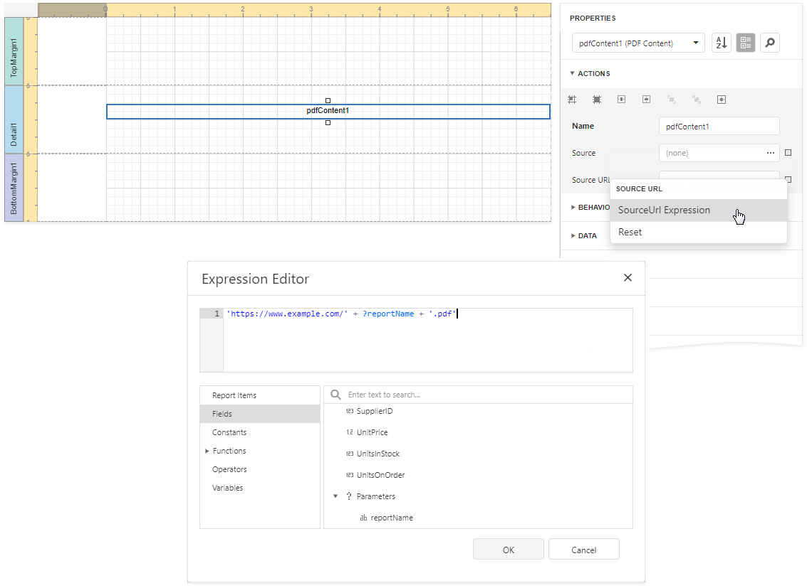

# PDF Content

**PDF Content** is a control that renders PDF content in a report.

PDF content is rendered on separate pages and uses its own page settings.

Use one of the following options to specify PDF content:

* [Specify PDF data](#specify-pdf-data).

    This data is stored in the report file. The source of this data does not need to be available when the report is rendered.

* [Specify a reference to a PDF document](#specify-a-reference-to-a-pdf-document).

    The reference to the document is stored in the report definition file. The referenced document should be available when the report is rendered.

## Add a PDF Content Control to a Report

Drop the **PDF Content** item from the Toolbox onto a [band](../../introduction-to-banded-reports.md) on the design surface.

## Specify PDF Data

You can assign PDF data to the control's **Source** property.

Expand the **PDF Content**'s smart tag and click the **Source** property's ellipsis button to obtain the binary data from a file.

When users save a report, the **Source** property value persists in the report file.

> [!TIP]
> See the [Use Expressions](#use-expressions) section below for information on how to conditionally specify the **Source** property value, or bind it to a report parameter or data source field.

## Specify a Reference to a PDF Document

You can use an external PDF document as a source of PDF data. Set the **Source URL** property to a local file system path or URL.

To specify the PDF document's location on the Web, specify the URL as the **Source URL** property's value.

When users save a report, the URL specified in the **Source URL** property is included in the report file. The PDF document should be available at the specified location when a report is printed or rendered in Preview.

> [!TIP]
> See the [Use Expressions](#use-expressions) section for information on how to conditionally specify the **Source URL** property value, or bind it to a report parameter or data source field.

The **Source URL** property value takes precedence over the **Source** property value. If you specify both properties, **PDF Content** includes the content specified by **Source URL**. However, if the file specified in the **Source URL** property cannot be loaded, the binary data from the **Source** property is used.

## Use Expressions

You can specify an expression that specifies the **Source** or **Source URL** property value. An expression can include [report parameters](../../shape-report-data/use-report-parameters.md) or [data source](../../bind-to-data.md) fields, or it can conditionally specify a property value.

Expand the **PDF Content**'s smart tag.

* Click the **Expression** property's ellipsis button below the **Source** property. Use the invoked **Expression Editor** to create an expression that identifies the source of binary PDF data.

    

* Click the **Expression** property's ellipsis button below the **Source URL** property. Use the invoked **Expression Editor** to create an expression the value of which identifies a URL or path to a PDF document.

    

## Limitations

* PDF content always starts on a new page. Report content is printed?on a new page after the PDF content is finished.

* PDF content is displayed as an image in Preview. Users cannot select text in PDF content. To allow users to select text, export the report to PDF.

* You cannot add the **PDF Content** control to the following bands:
    * **Top Margin** / **Bottom Margin**
    * **Page Header** / **Page Footer**
    * **Group Header** / **Group Footer** bands (if their **Repeat Every Page** properties are enabled).
    * **Vertical Header** / **Vertical Detail** / **Vertical Total**
