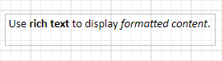
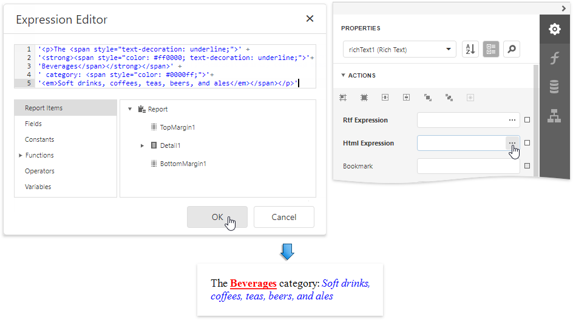
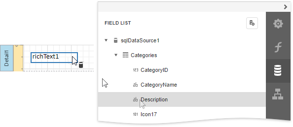

# Rich Text

## Overview

The **Rich Text** control displays formatted text (static, dynamic or mixed) in a report.

To add this control to a report, drag the **Rich Text** item from the [Toolbox](../../report-designer-tools/toolbox.md) onto the report's [Design Surface](../../report-designer-tools/design-surface.md).

## Load Content from a File

You can load RTF or HTML content from an external file. Expand the **Data** category and click the **Load file** property's ellipsis button.

In the invoked **Open** dialog, select the file and click **Open**.

Rich Text supports the following file formats:

* RTF
* DOCX
* TXT
* HTML

## Edit Content in Place

Double-click a Rich Text control and type text in the invoked in-place editor. A ribbon with text format options appears next to the editor.

Rich Text supports the following edit operations:

* **Undo/Redo History**

    The undo/redo history contains the last 100 operations and is available until you exit the in-place edit mode.

* **Clipboard Operations**

    You can use clipboard operations (Cut, Copy, and Paste) to manipulate text and images.

* **Hyperlinks**

    You can create and modify hyperlinks.

* **Drag and Drop**

    Use Drag and Drop to move images and text within the editor.

> [!NOTE]
> The legacy Rich Text does not provide a ribbon with text format options. Its in-place editor allows you to enter only plain text. Bind the control to a data field that provides RTF or HTML content to display formatted text.
> 
> 

## Bind to Data

Click the **Rtf Expression** or **Html Expression** option's ellipsis button to invoke the [Expression Editor](../../report-designer-tools/expression-editor.md). Use this editor to bind the control to a data field or construct a complex binding expression with two or more data fields.

You can use HTML formatted text that contains markup tags to define text appearance. Click the **Html Expression** option's ellipsis button and enter this text in **'** quotes **'** in the invoked [Expression Editor](../../report-designer-tools/expression-editor.md).

Drag and drop a numeric or text field from the [Field List](../../report-designer-tools/ui-panels/field-list.md) onto the **Rich Text** control to bind it to this field.

The Rich Text also enables you to merge data fields and static content in its text.

See the [Bind Controls to Data](../bind-controls-to-data.md) and [Use Embedded Fields](../use-embedded-fields-mail-merge.md) topics for more information.

## Markup Text

### Supported Tags

The table below lists the supported HTML tags. External links are processed for inline pictures and style sheets (CSS files). The ID and Class attributes are interpreted for all tags, including the unlisted ones. These attributes are used to specify a style for content within a certain tag

| Tag | Attributes | Notes |
---------|----------|---------
| a | dir |  |
| b | dir |  |
| base |  |  |
| basefont | size color face dir |  |
| big | dir |  |
| blockquote | dir |  |
| br | dir |  |
| center | dir |  |
| code | dir |  |
| del | cite datetime |  |
| div | page-break-before page-break-after page-break-inside background-color border (CSS) dir | Only the **always** property value is supported for the **page-break-before** tag. |
| em | dir |  |
| font | size color face dir |  |
| h1-h6 | align dir | |
| head |  |  |
| html |  |  |
| hr | align color noshade size width |  |
| i | dir |  |
| ins | cite datetime |  |
| img | align src height width | If the **align** attribute is not specified, the image is considered as inline. |
| li | type value dir |  |
| link | href type media dir |  |
| meta |  |  |
| ol | type value align dir |  |
| p | align dir |  |
| script |  | Text inside this tag is ignored. |
| small |  |  |
| span |  |  |
| strike | dir |  |
| strong | dir |  |
| style |  |  |
| sub | dir |  |
| sup | dir |  |
| table | align bgcolor border bordercolor cellpadding cellspacing dir width | The **dir** attribute reorders table columns. |
| td | align bgcolor bordercolor colspan height nowrap rowspan text-align valign width | The **align** tag is supported in the Internet Explorer only. The **Rich Text** control's interpretation of the **bordercolor** attribute is different from the HTML browser. |
| th | any allowed |  |
| tr | align bgcolor bordercolor height text-align valign | The **align** attribute is supported in the Internet Explorer only. |
| title |  | Text inside this tag is ignored. |
| u | dir |  |
| ul | dir |  |

### Unsupported Tags

* &lt;base&gt; tag with _href_ attribute;
* &lt;div&gt; tag with _border_, _align_ and _float_ CSS attribute;
* &lt;li&gt; tag with _list-style-image_ CSS attribute;
* &lt;margin&gt; tag;
* &lt;tab&gt; tag;
* &lt;table&gt; tag with _cols_ attribute;
* &lt;td&gt; tab with _bordercolor_ and _nowrap_ attributes;
* _!important_ declaration;
* _word-wrap_ and _break-word_ css properties;
* css3 shapes;
* &lt;ui&gt; tag with _type_ attribute.

### Export to Excel

When a report is exported to XLS or XLSX, the following rich-text content is converted from **Rich Text** controls into Excel-native rich-text content:

| | HTML Tags and RTF Equivalents |
| --- | --- |
| Text format | \<b>, \<i>, \<u>, \<s>, \<strong>, \<em> |
| Line break | \  |
| Non-breaking space | \&nbsp; |
| Font | \ |
| Font size | \ |
| Foreground color | \ |
