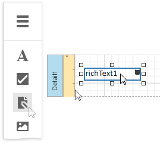

# Rich Text

## Overview

The **Rich Text** control displays formatted text (static, dynamic or mixed) in a report.

To add this control to a report, drag the **Rich Text** item from the [Toolbox](../../report-designer-tools/toolbox.md) onto the report's [Design Surface](../../report-designer-tools/design-surface.md).

## Load Content from a File

You can load RTF or HTML content from an external file. Expand the **Data** category and click the **Load file** property's ellipsis button.

In the invoked **Open** dialog, select the file and click **Open**.

Rich Text supports the following file formats:

* RTF
* DOCX
* TXT
* HTML

## Edit Content in Place

Double-click a Rich Text control and type text in the invoked in-place editor. A ribbon with text format options appears next to the editor.

Rich Text supports the following edit operations:

* **Undo/Redo History**

    The undo/redo history contains the last 100 operations and is available until you exit the in-place edit mode.

* **Clipboard Operations**

    You can use clipboard operations (Cut, Copy, and Paste) to manipulate with text and images.

* **Hyperlinks**

    You can create and modify hyperlinks.

* **Drag and Drop**

    Use Drag and Drop to move images and text within the editor.

> [!Note]
> The legacy Rich Text does not provide a ribbon with text format options. Its in-place editor allows you to enter only plain text. Bind the control to a data field that provides RTF or HTML content to display formatted text.
> 
> 

## Bind to Data

Click the **Rtf Expression** or **Html Expression** option's ellipsis button to invoke the [Expression Editor](../../report-designer-tools/expression-editor.md). Use this editor to bind the control to a data field or construct a complex binding expression with two or more data fields.

You can use HTML formatted text that contains markup tags to define text appearance. Click the **Html Expression** option's ellipsis button and enter this text in **'** quotes **'** in the invoked [Expression Editor](../../report-designer-tools/expression-editor.md).

Drag and drop a numeric or text field from the [Field List](../../report-designer-tools/ui-panels/field-list.md) onto the **Rich Text** control to bind it to this field.

The Rich Text also enables you to merge data fields and static content in its text.

See the [Bind Controls to Data](../../bind-to-data/bind-controls-to-data-expression-bindings.md) and [Use Embedded Fields](../../bind-to-data/use-embedded-fields-mail-merge.md) topics for more information.
