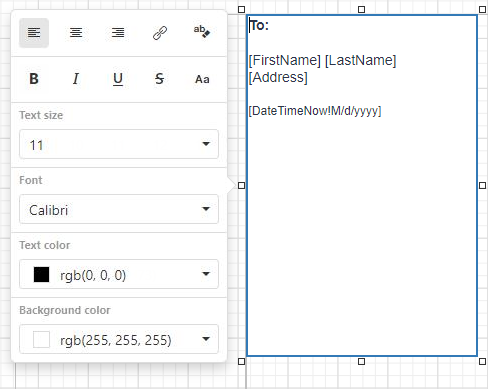
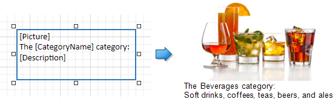

# Rich Text

## Overview
The **Rich Text** control displays formatted text (static, dynamic or mixed) in your report.

To add this control to a report, drag the **Rich Text** item from the [Toolbox](../../report-designer-tools/toolbox.md) onto the report's area.

You can load RTF or HTML content from an external file. Expand the **Data** category and click the **Load file** property's ellipsis button.

In the invoked **Open** dialog, select the file and click **Open**.

You can double-click the Rich Text to invoke its in-place editor and enter static text. 

Press CTRL+Enter to submit changes and exit the in-place editor.

> [!NOTE]
> The Rich Text's in-place editor allows you to enter only plain text. Bind the control to a data field that provides RTF or HTML content to display formatted text.

## Bind to Data

Click the **Rtf Expression** or **Html Expression** option's ellipsis button to invoke the **Expression Editor**. This editor allows you to bind the control to a data field or construct a complex binding expression with two or more data fields. 

You can use HTML formatted text, which contains markup tags to define text appearance. Click the **Html Expression** option's ellipsis button and enter this text in **'** quotes **'** in the invoked **Expression Editor**.

Drag and drop a numeric or text field from the [Field List](../../report-designer-tools/ui-panels/field-list.md) onto the **Rich Text** control to bind it to this field.

The Rich Text also enables you to merge data fields and static content in its text. 

See the [Bind Controls to Data](../../bind-to-data/bind-controls-to-data-expression-bindings.md) and [Use Embedded Fields](../../bind-to-data/use-embedded-fields-mail-merge.md) topics for more information.
