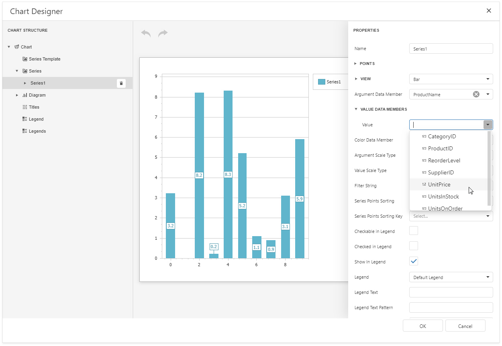
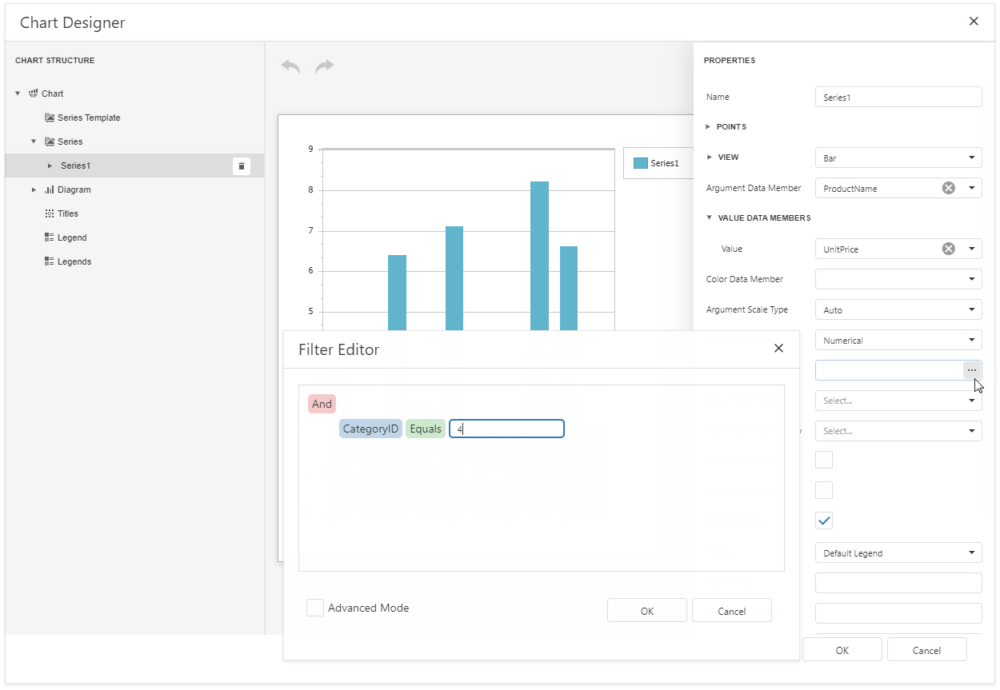
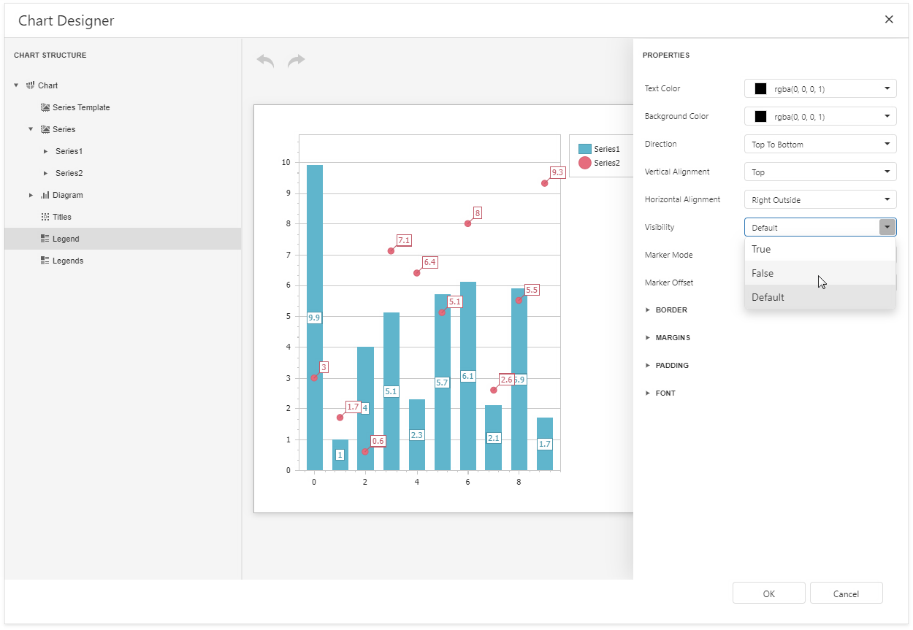

# Add a Chart (Set Up Series Manually)

This document demonstrates how to add a chart to a report, provide data for chart series, and set up chart elements. This topic shows two chart series based on the same data source. You can use different data sources for different series.

## Add a Chart to a Report

1. [Bind a report to data](../../bind-to-data.md).

1. Drop the **Chart** control from the [Toolbox](../../report-designer-tools/toolbox.md) onto the [Detail band](../../introduction-to-banded-reports.md).

    

1. Click **Run Designer**.

    

1. Specify the **Data Source** and **Data Member** properties to bind the chart to data.

	

> [!NOTE]
> Ensure that the report's **Data Source** property is set to **None** when you place a chart into the **Detail** band. Otherwise, the chart is repeated as many times as there are records in the report's data source.

## Add Series to the Chart

1. Locate **Series** in the chart elements tree and click the plus button. Select the series type (for example, **Bar**) from the invoked list.

    

3. Populate the created series with points. Specify the **Argument Data Member** and **Value** properties.

    

4. Filter series data. Click the **Filter String** property's ellipsis button. Construct filter criteria in the invoked FilterString Editor and click **OK**.

    

5. Create another series with the same settings. Select the **Point** view type for this series.

## Customize the Chart

Improve the chart's appearance:

* Remove the chart legend, because the chart series are bound to the same data. Select **Legend** in the chart elements tree and set the **Visibility** property to **False**.

    

* Hide point labels. Select **Series1** and set the **Labels Visibility** property to **False**.

    

* Customize the **Series2** markers' appearance. Select **Series2** and expand the **View**/**Point Marker Options** categories. Set **Size** to **12** and **Kind** to **InvertedTriangle** to replace the default circle with an upside down triangle.

    

* Customize the chart's appearance settings. For instance, set chart elements' colors.

## View the Result

Switch to [Print Preview](../../preview-print-and-export-reports.md) to preview your report.

