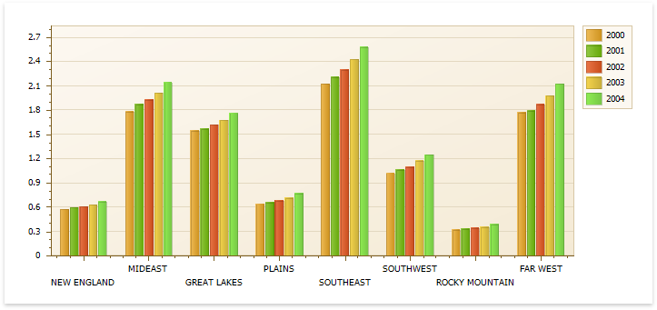
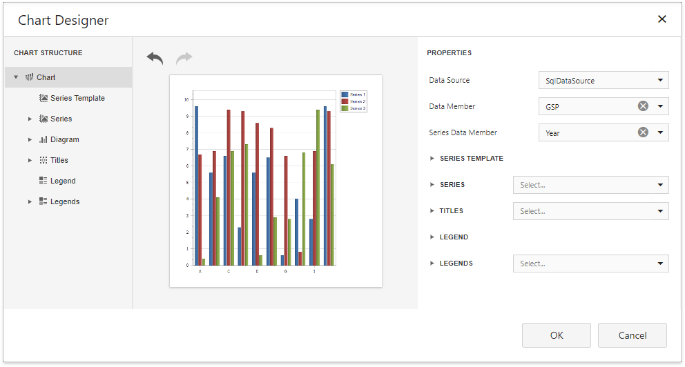
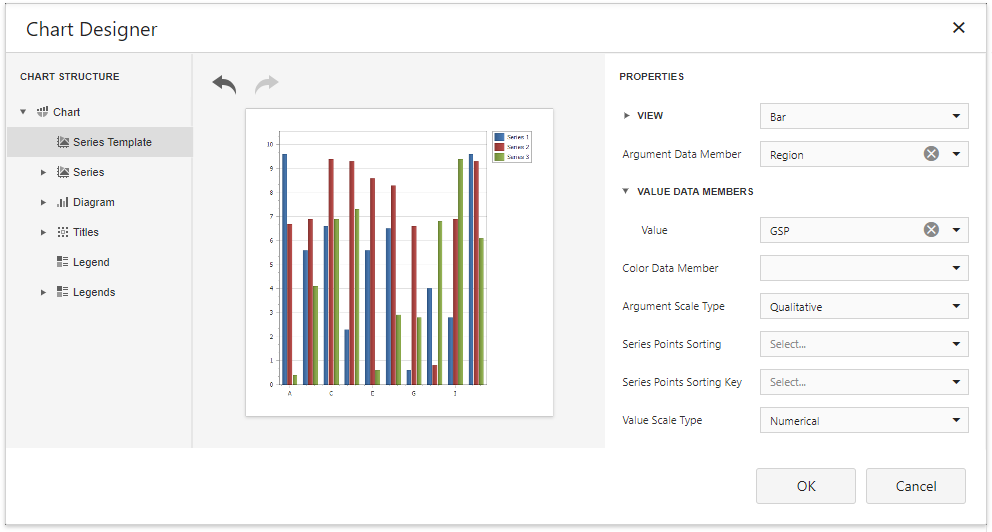

# Add a Chart (Use a Series Template)

This document describes how to create a report with a **Chart** control bound to data and generate all series automatically based on a common template.

## Add a Chart to a Report

1. Drop the **Chart** control from the [Toolbox](../../report-designer-tools/toolbox.md) onto the [Detail band](../../introduction-to-banded-reports.md).

    

2. Click **Run Designer...** to invoke the Chart Designer.

    

3. Specify the **Data Source** and **Data Member** properties to bind the chart to data. The chart's **Series Data Member** property specifies a data field that should provide data for series names. A new series should be created for each record in this data field.
	
	

> [!NOTE]
> The report's **Data Source** property should be set to **None** because the Chart is in the Detail band. When a report has its **Data Source** property specified, the Chart is repeated in preview as many times as there are records in the report data source.

## Adjust the Series Template

1. Use the **Argument Data Member** and **Value Data Members** properties to define where to get data for point arguments and values.

    

Make sure that the **Argument Scale Type** and **Value** properties are set to appropriate values.

## Customize the Chart
Perform the following customization to improve the chart's appearance:

* Set the **Labels Visibility** property to **False** to avoid overlapping series labels. 
* Specify the color settings used to draw the chart's series. For instance, select **Nature Colors** in the **Palette**'s drop-down list.

## View the Result
Switch to [Print Preview](../../preview-print-and-export-reports.md) to see the resulting report.

