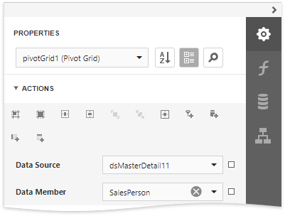
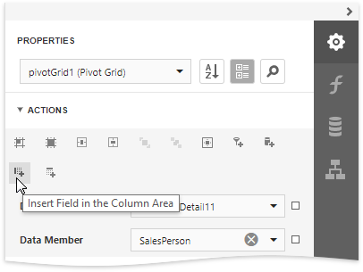
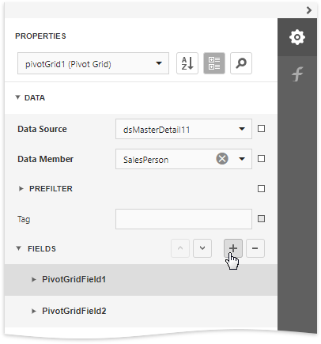
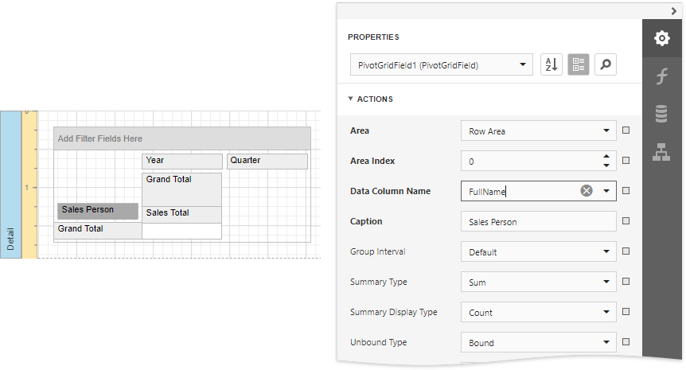
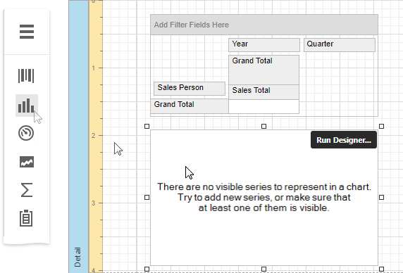
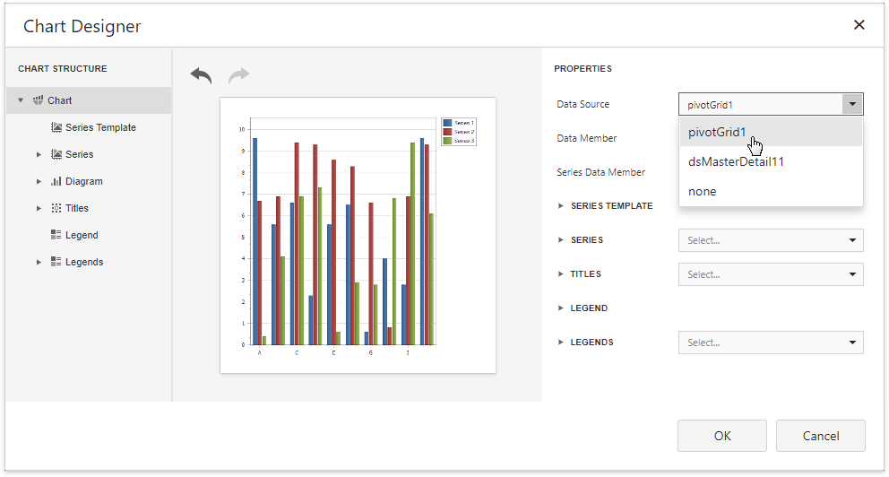
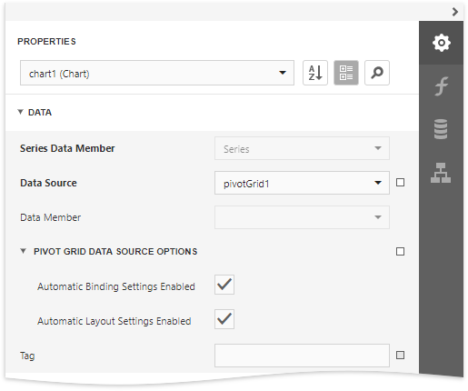
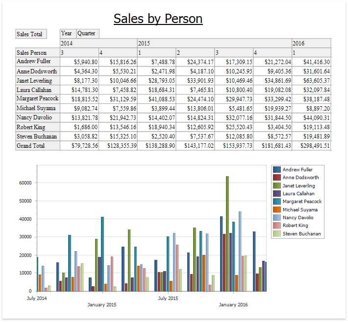

# Link a Chart and a Pivot Grid

This tutorial demonstrates how to use the Chart control to visualize the Pivot Grid control's data.

## Create a Pivot Grid

1. Drop the **Pivot Grid** control from the [Toolbox](../../report-designer-tools/toolbox.md) onto the [Detail band](../../introduction-to-banded-reports.md).

    

2. Specify the **Data Source** and **Data Member** properties to bind the Pivot Grid to data.

    

3. Insert fields in the **Filter**, **Data**, **Column** and **Row** areas to define the Pivot Grid's layout. Select the corresponding command in the **Actions** category.

    

    Alternatively, select the Pivot Grid, expand the **Fields** node in the **Data** category to manage the control's fields and access their properties.

    

4. Select the Pivot Grid's field and specify its **Data Column Name** property to bind it to data. 

    

## Link a Chart with the Pivot grid

1.  Drop the **Chart** control from the [Toolbox](../../report-designer-tools/toolbox.md) onto the Detail band below the Pivot Grid.

    

2. Click **Run Designer** to invoke the **Chart Designer**. Choose the Pivot Grid in the **Data Source** property's drop-down list.

    

3. Select the **Series Template** node in the chart elements tree and disable the **Labels Visibility** check box to avoid overlapping series labels.

    

4. (optionally) You can customize various settings that determine a linked Chart and Pivot Grid pair's common behavior. To do this, use the Chart's **Pivot Grid Data Source Options** property. This property is synchronized with the Pivot Grid's **Options Chart Data Source** property.

    

## View the Result

Switch to [Print Preview](../../preview-print-and-export-reports.md) to see the resulting report.

