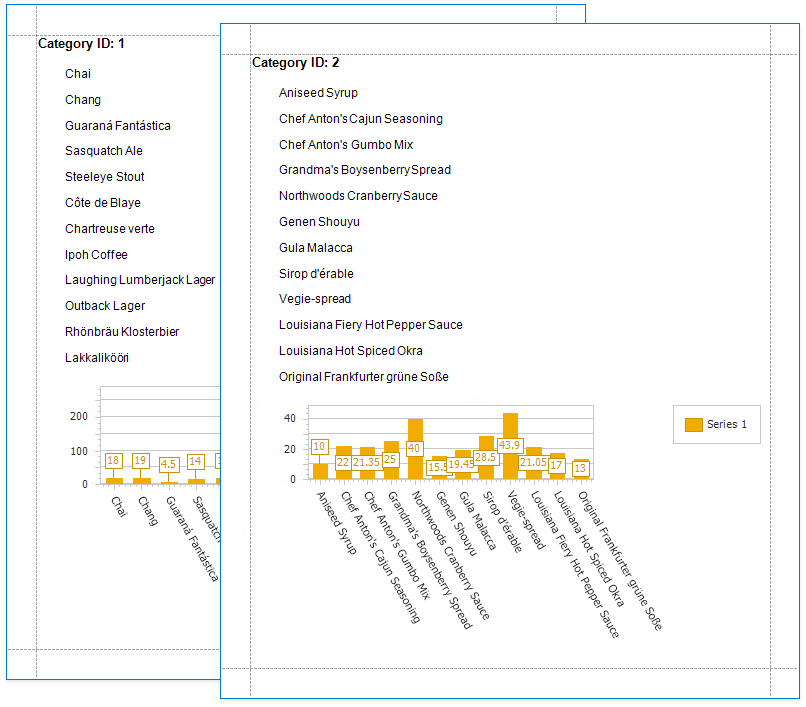
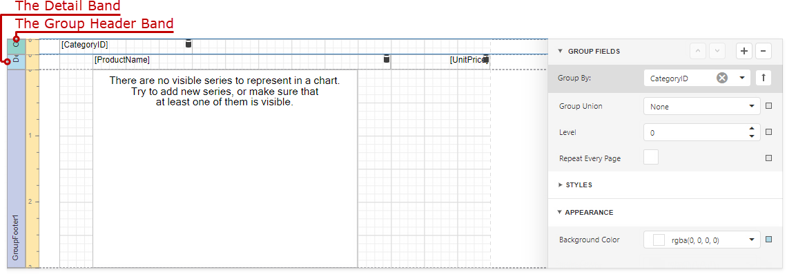
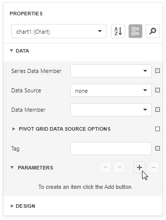
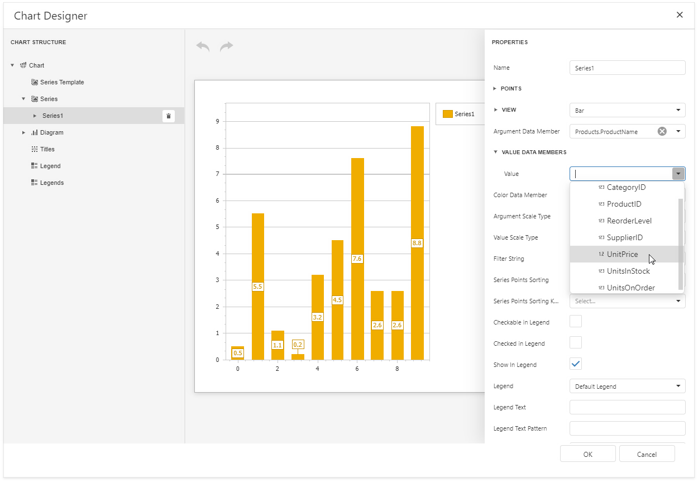
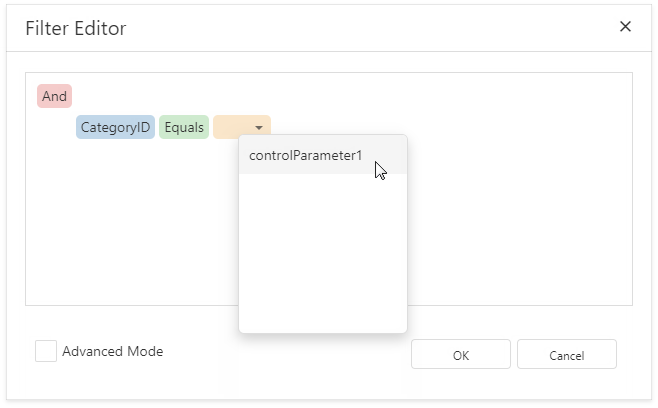

# Use Charts to Visualize Grouped Data

This topic describes how to use charts to visualize grouped data in a report.

In this tutorial, the report data is grouped against a data field (the report's group field). A chart is placed in the Group Footer band and is not bound to data. The report's data source is used to populate the chart with data.

Follow the steps below to make each chart instance display data for its group.

1. Create a chart parameter to pass a group value from the report's group field to the chart.

	Select the chart and expand the **Data** group in the **Properties** panel. Click the plus button next to the **Parameters** property.

	

	Set the parameter's **Binding** property to the report's group field.

	

1. Click **Run Designer** to invoke the Chart Designer.

	

1. Bind the chart to data. Specify the **Data Source** and **Data Member** fields.

	

1. Add a new series. Click the plus button next to the Series item in the Chart Designer.

	

1. Provide data for the argument and value axes. Set the **Argument Data Member** and **Value** properties.

	

1. Filter the chart. Click the **Filter String** property's ellipsis button.

	

	Add a filter condition. On the left side, specify the field by which chart data should be filtered.

	

	On the right side, use the chart parameter to obtain a group value from the report's group field. Click the right side's down arrow and select **Parameter**. Then select the chart parameter from the context menu.

	

Click **OK** in the Filter Editor and in the Chart Designer to apply changes.

Switch to [Print Preview](../../preview-print-and-export-reports.md) to see the result.

