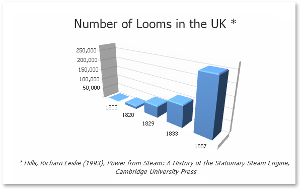
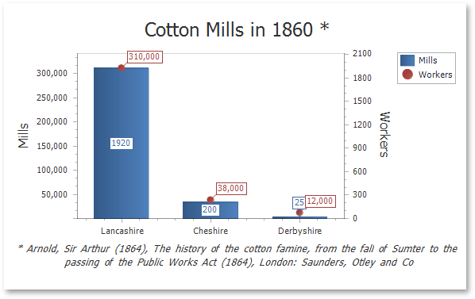
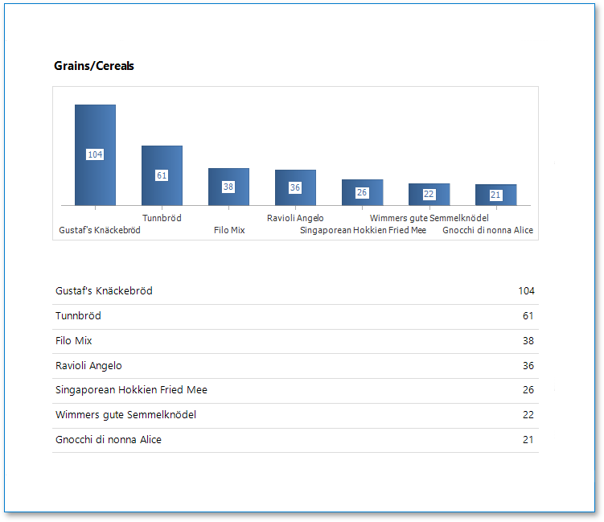

# Use Charts in Reports

## Overview

You can use the **Chart** control to add a chart to a report. This control provides 2D or 3D views to visualize data series (for instance, Bar, Point, Line, Pie and Doughnut, Area, etc.).

| 2D Series View | 3D Series View |
|---|---|
|  |  |

The **Chart** control can display multiple series.

| Bar and Point Series | Nested Doughnut Series |
|---|---|
|  | |

The **Chart Designer** allows you to create and set up the **Chart** control and customize its visual elements (diagrams, series, legends, primary and secondary axes, titles and labels, etc.).

## Bind to Data

To provide data to a chart, use the **Data Source** property.

When the chart data source is not assigned, the chart obtains data from the report's data source 

A chart can display report data in the following ways:

* Place a chart on the report header/footer band to display a summary for the detail report data.

    

* Place a chart on a group header/footer to visualize data in each report group. Refer to the [Use Charts to Visualize Grouped Data](use-charts-to-visualize-grouped-data.md) step-by-step tutorial for more information.

    

* The chart in the Detail band is printed as many times as there are records in the report's data source. 

Specify the following settings to provide data to a chart's series.

* The **Argument Data Member** property specifies the data field that provides point arguments.
* The **Value Data Members** property specifies the data fields that supply point values.

You can specify these settings in the following ways:

* **Bind each series individually**

    Add a new series to the chart and specify the argument and value data members. Refer to the [Add a Chart (Set Up Series Manually)](add-a-chart-set-up-series-manually.md) step-by-step tutorial for details.

* **Create series dynamically**

    Assign the data field that contains series names to the chart's **Series Data Member** property and specify the argument and value data members using the series template. Refer to the [Add a Chart (Use a Series Template)](add-a-chart-use-a-series-template.md) step-by-step tutorial for more information.
