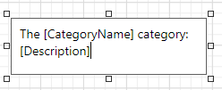

# Use Embedded Fields (Mail Merge)

This topic describes how to provide data to report controls using the advanced **Mail Merge** binding method. This feature allows you to create templates in which data source values populate specific fields while other text remains constant (that is, allows you to combine static and dynamic content within the same control).

## Embed Fields in a Control Text
You can apply mail merge to the control's **Text** property only. Double-click the required control on the design surface to invoke the in-place editor. Insert data field names with square brackets to create embedded fields and use any prefixes or postfixes.

You can embed a [parameter](../use-report-parameters.md)'s value into a control's content using the **?ParameterName** syntax.

Embedded fields are replaced with values obtained from an assigned data source when previewing or exporting a report:

Consider the following specifics and limitations when using embedded fields:

* Field names should not use spaces to be interpreted correctly.
* Mail Merge is not available for a table's nested fields in a master-detail hierarchy.
* Embedded fields cannot be exported to [XLS](../../document-viewer/exporting/xls-specific-export-options.md) and [XLSX](../../document-viewer/exporting/xlsx-specific-export-options.md) as values; they are always exported as plain text. We recommend using [text formats](../shape-report-data/format-data.md) instead if you need to accompany dynamic data with static text.

## Format Embedded Fields

You can add a format to the target data field by separating it from the field name with the **!** symbol and apply this format to field values when previewing a document.

## Supported Controls
You can apply the mail merge feature to the **Text** of the following report controls:

* [Barcode](../use-report-elements/use-bar-codes.md)
* [Character Comb](../use-report-elements/use-basic-report-controls/character-comb.md)
* [Check Box](../use-report-elements/use-basic-report-controls/check-box.md)
* [Label](../use-report-elements/use-basic-report-controls/label.md)
* [Rich Text](../use-report-elements/use-basic-report-controls/rich-text.md)
* [Table Cell](../use-report-elements/use-tables.md)