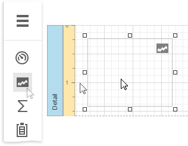
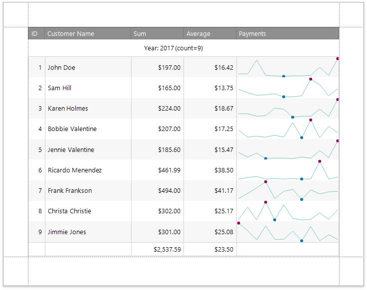

# Add Sparklines to a Report

## Sparkline Overview
The **Sparkline** control displays a compact chart that is commonly used to illustrate the data flow for every row in a report.

To add this control to the report, drag the **Sparkline** item from the [Toolbox](../../report-designer-tools/toolbox.md) and drop it onto the report.

## Bind the Sparkline to Data
You can connect the sparkline to individual data without accessing a report's data source. Click the **Data Source** property's drop-down list and select the required data source.

The sparkline uses the report's data source if you do not specify the **DataSource** property.

After that, specify the **Data Member** property and set the **Value Member** property to a data field that provides point values for the sparkline.

To create a new data source for a sparkline, click **Add Data Source...** in the [Menu](../../report-designer-tools/menu.md). This invokes the [Data Source Wizard](../../report-designer-tools/data-source-wizard.md) that allows you to set up a required data source.

## Adjust the Sparkline View

The sparkline supports the **Line**, **Area**, **Bar** and **WinLoss** view types.

The **View** property provides access to options that change the sparkline's appearance.

Each view type has properties that define the extreme values' visibility:

* **Highlight Start Point** and **Highlight End Point**;
* **Highlight Min Point** and **Highlight Max Point**.

Specific properties differ between view types, such as the **Highlight Negative Points** setting that is available only for the **Bar** sparkline.

The following image illustrates a [table report](../../create-reports/table-reports.md) containing sparklines that provide maximum and minimum value indicators in their data range:

