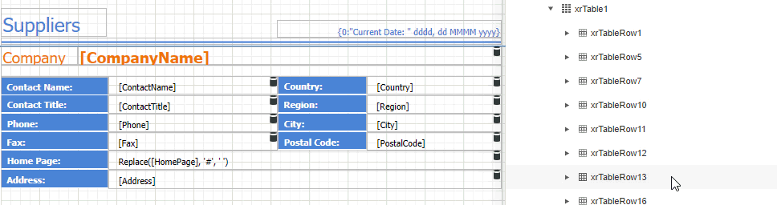

# Manipulate Table Elements

## Select Table Elements

You can click a table cell to select it and [access its settings](../manipulate-report-elements/select-report-elements-and-access-their-settings.md). To select multiple cells, hold the CTRL key and click cells.

Use the arrow that appears when a mouse cursor hovers over the table edges to select an entire row or column.

Draw a rectangle around the table to select the whole control.

The [Properties](../../../report-designer/report-designer-tools/ui-panels/properties-panel.md) panel enables you to select the table element or the entire table and access their properties.

## Resize Table Elements

You can resize a table or its cell by dragging the rectangle drawn on its edge or corner. 

Resizing a column changes the next column's width without affecting the other columns (keeps the table dimensions intact).
	

Resizing a row changes the next row's width without affecting the other rows (keeps the table dimensions intact).
	

You can set the same size for multiple table columns or rows. Select the required rows or the whole table, right-click the selected area and choose **Distribute Rows Evenly**.

If the cell's content is partially visible in the resulting row, this row automatically increases its height to fit its content and also adjusts the other rows accordingly.

You can resize columns equally in a similar way by selecting the columns or the table itself and choosing **Distribute Columns Evenly** in the context menu.

## Reorder Table Rows and Cells

You can change the order of table rows and cells. Switch to the [Report Explorer](../../report-designer-tools/ui-panels/report-explorer.md), select a row or cell and drag it to a new position.

The Report Explorer highlights the possible drop targets when you drag an element over them.

> [!NOTE]
> You can move table rows and cells only within the same parent control.

## Stretch Table Cells

You can stretch a cell to occupy several rows and columns.

- Stretch a cell across several columns  
  Press DELETE or select the **Delete Cell** command in the **Action** category to remove a neighboring cell.

  

- Stretch a cell across several rows  
  Use a table cell's **Row Span** property to specify the number of rows the table cell spans.

  

  > [!NOTE]
  > For the **RowSpan** property to work properly, the spanned cells should have the same width.
