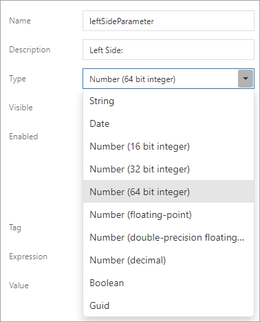
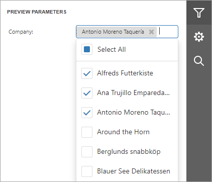
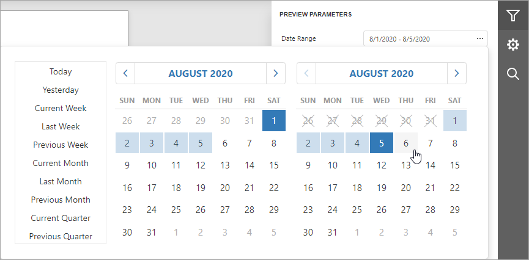
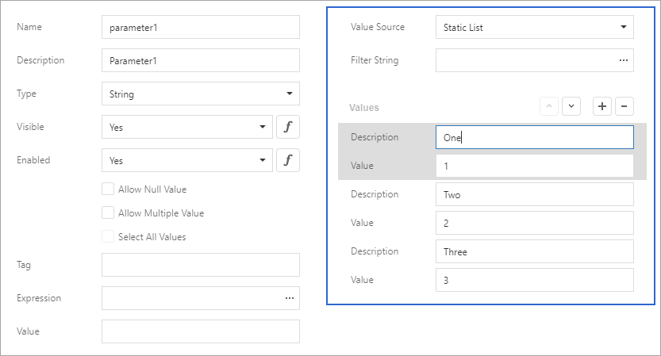
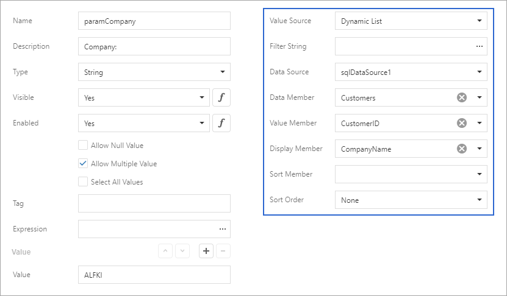
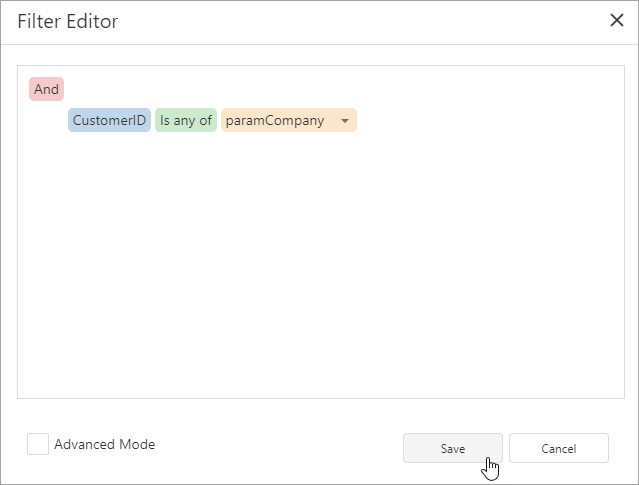
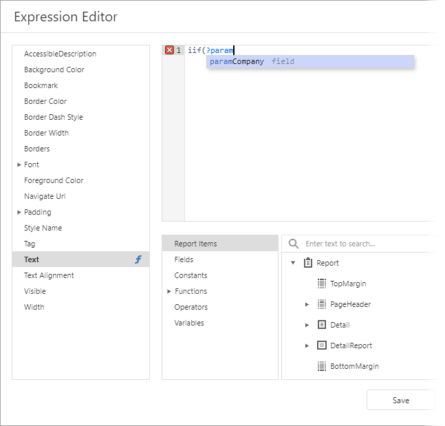
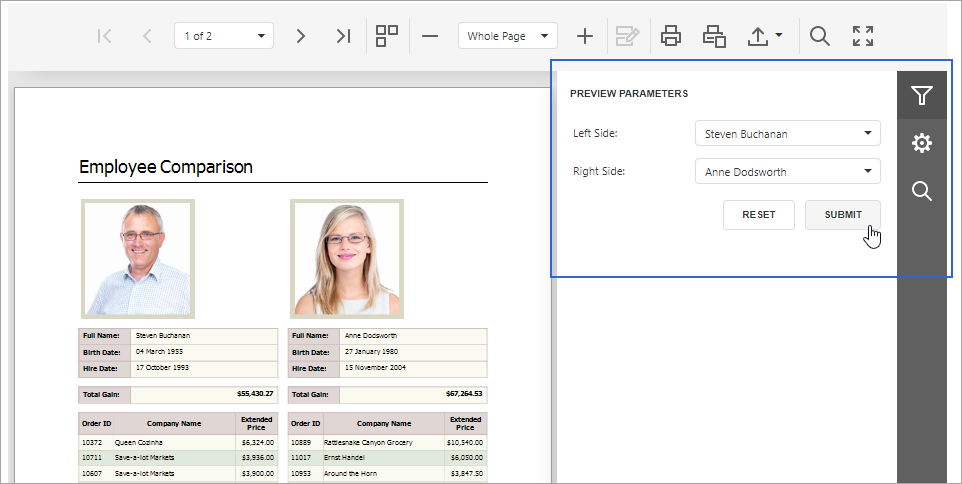

# Use Report Parameters

Report parameters allow you to filter report data dynamically.

## Supported Features/Capabilities

* Built-in parameter types (String, Date, Number, Boolean, and GUID)

    

* [Multi-value parameters](use-report-parameters/multi-value-report-parameters.md) (filter report data against multiple criteria)

    

* [Cascading parameters](use-report-parameters/cascading-report-parameters.md) (filter a parameter’s value list against selections made in a different parameter)

    

* [Date-range parameters](use-report-parameters/date-range-report-parameters.md) (filter report data against a specified time period)

    

* [Static parameter values](use-report-parameters/report-parameters-with-predefined-static-values.md) (create pre-defined (static) parameter value lists)

    

* [Dynamic parameter values](use-report-parameters/report-parameters-with-predefined-dynamic-values.md) (load parameter values from a data source dynamically)

    

Refer to the following documentation section for more details: [Create a Report Parameter](use-report-parameters/create-a-report-parameter.md).

## Reference Report Parameters

Once you [create](use-report-parameters/create-a-report-parameter.md) a parameter, you can reference it in your report’s [filter string](shape-report-data/filter-data/filter-data-at-the-report-level.md) to filter underlying report data.

You can also reference the parameter in a report control’s [expression](use-expressions.md) or its **Text** property.

When used in this manner, you can filter data displayed within an individual report control (such as [Label](use-report-elements/use-basic-report-controls/label.md)) conditionally.

You can also bind data source parameters to report parameters and filter data at the data source level. Refer to the following help topic for more information: [Reference Report Parameters](use-report-parameters/reference-report-parameters.md).

## Specify Parameter Values

Available report parameters appear within a report’s **Print Preview** window (inside the [Parameters panel](use-report-parameters/parameters-panel.md)). Use this panel to specify desired parameter values:

