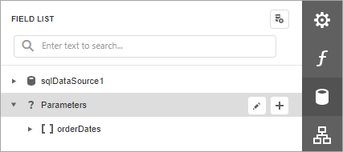
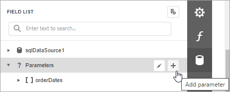
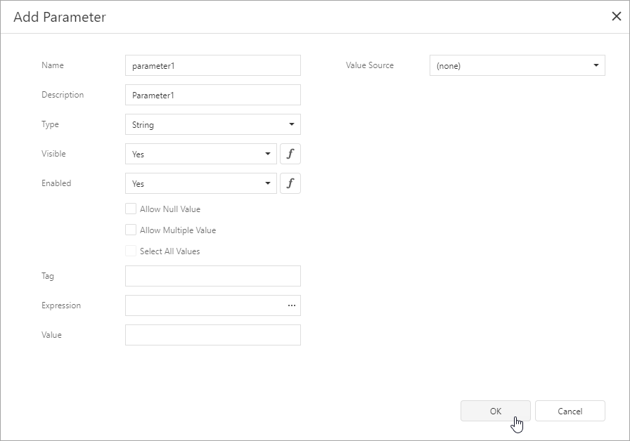
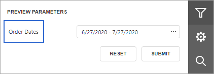
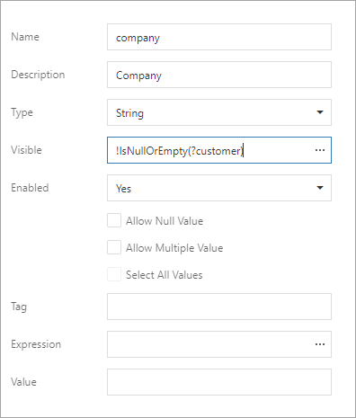
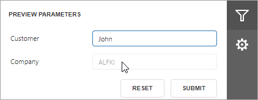
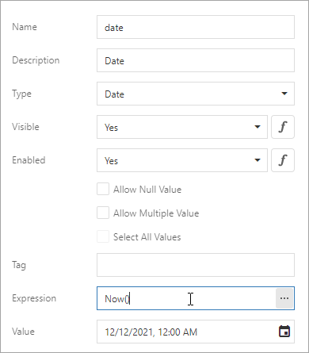
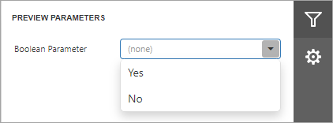

# Create a Report Parameter

This topic demonstrates how to create a report parameter in the [Report Designer](../first-look-at-the-report-designer.md). The topic also describes the [options](#parameter-options) you can specify for a report parameter.

## Create a Report Parameter in the Report Designer

In the **Report Designer**, you can create a parameter from the [Field List](../report-designer-tools/ui-panels/field-list.md) and [Properties panel](../report-designer-tools/ui-panels/properties-panel.md). The created parameter appears in the [Field List](../report-designer-tools/ui-panels/field-list.md)'s **Parameters** node.

### Create From the Field List

Click the plus button in the [Field List](../report-designer-tools/ui-panels/field-list.md)'s **Parameters** node.

Specify [parameter options](#parameter-options) in the invoked **Add New Parameter** dialog and click *OK*.

### Create From the Properties Panel

Select a report, navigate to the [Properties panel](../report-designer-tools/ui-panels/properties-panel.md) *Data* section, and click the plus button right to the *Parameters* node.

Specify [parameter options](#parameter-options) in the invoked **Add New Parameter** dialog and click *OK*.

## Parameter Options

### Name

The name by which you can [reference a parameter in a report](reference-report-parameters.md). Note that report parameters should have unique names.

### Description

A parameter description that appears on a report's **Print Preview** in the [Parameters panel](parameters-panel.md).

### Visible

Specifies whether a parameter is visible in the [Parameters panel](parameters-panel.md).

You can assign an [expression](../use-expressions.md) to this option. The example below specifies an expression that shows/hides a parameter based on a value of another parameter.

### Enabled

Specifies whether a parameter editor is enabled or disabled in the [Parameters panel](parameters-panel.md). You can set this option to **No** to make a parameter's [default value](#default-value) read-only.

You can also assign an [expression](../use-expressions.md) to this option. The example below specifies an expression that enables/disables a parameter's editor based on a value of another parameter.

### Type

The type of parameter values. The following types are available:

* String;
* Date;
* Number (16-bit integer);
* Number (32-bit integer);
* Number (64-bit integer);
* Number (floating point);
* Number (double-precision floating point);
* Number (decimal);
* Boolean;
* GUID (Globally Unique Identifier).

### Default Value

A parameter's default value. This value is displayed in the [Parameters panel](parameters-panel.md) when you open a report's **Print Preview**.

You can specify an [expression](../use-expressions.md) for this option. For example, set this option to **Now()** to use the current date as a date parameter's default value.

> [!NOTE]
> You can use only [constants](../use-expressions/expression-language.md#constants), [operators](../use-expressions/expression-language.md#operators), and date-time / logical / math / string [functions](../use-expressions/expression-language.md#functions) in an expression for a parameter's default value.

### Allow Null Value

When the **Allow Null Value** option is enabled, you can leave the parameter's value unspecified.

### Allow Multiple Values

When the **Allow Multiple Values** option is enabled, you can specify multiple values for a report parameter.

### Select All Values

Enable the **Select All Values** option to use all elements from a [custom set of values](#value-source) as a parameter's [default value](#default-value).

> [!NOTE]
> You can specify the **Select All Values** option only when the **Allow Multiple Values** option is enabled.

### Value Source

Use the **Value Source** option to specify a custom set of values a parameter can accept. You can create a static list of values, load values from a data source, or specify a date range. Refer to the following topics for more details:

* [Report Parameters with Predefined Static Values](report-parameters-with-predefined-static-values.md)
* [Report Parameters with Predefined Dynamic Values](report-parameters-with-predefined-dynamic-values.md)
* [Date Range Report Parameters](date-range-report-parameters.md)
