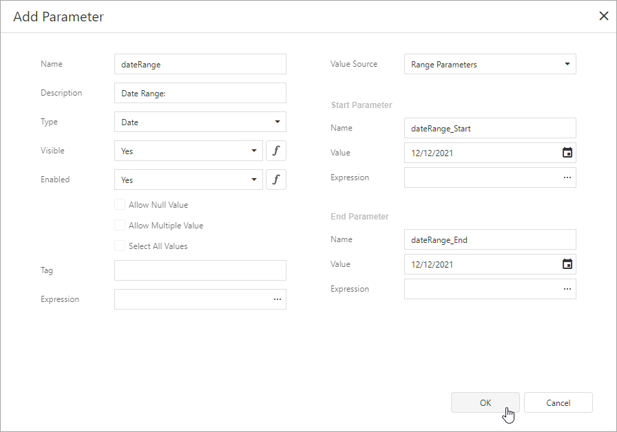

# Date Range Report Parameters

This topic describes how to create a date range parameter and filter a report's data by the specified dates.

## Create a Date Range Parameter in the Report Designer

Follow the steps below to add a date range parameter to a report in the [Report Designer](../first-look-at-the-report-designer.md):

1. [Create a report parameter](create-a-report-parameter.md) and set the **Value Source** option to **Range Parameters**. The **Start Parameter** and **End Parameter** sections appear, and you can configure options in these sections to create a date range.

    

2. Set the name and initial value for the **Start Parameter** and **End Parameter**. To specify an [expression](../use-expressions.md) instead of a static value, click the **Value** option's ellipsis button and use the **Expression Editor** dialog.

    

After you create a date range parameter, you can reference the names of the **Start Parameter** and **End Parameter** in the report's filter string to [filter the report's data](../shape-report-data/filter-data/filter-data-at-the-report-level.md) by the created date range. Select the report, click the **FilterString**'s ellipsis button in the **Properties window**, and construct a filter condition in the invoked **FilterString Editor**.

When you switch to the report's **Print Preview** tab, the [Parameters panel](parameters-panel.md) displays the date range parameter. After you submit a start and end date, the report document shows filtered data.

The start and end parameter values store the selected day's midnight time. For instance, if you choose _10/15/2019_, the *DateTime* value is _10/15/2019 12:00:00 AM_. If your date fields include non-midnight times, records for the end date _10/15/2019_ are excluded from the report. To include data for the 10/15/2019 date, use the **GetDate()** function in the **FilterString Editor**.  

