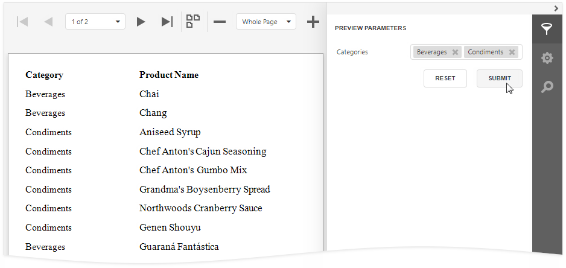
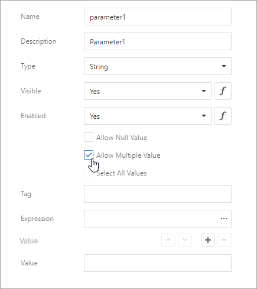
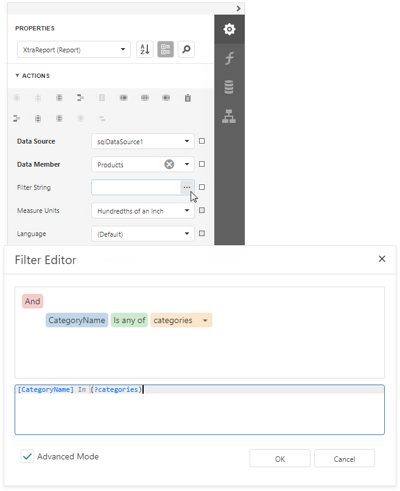
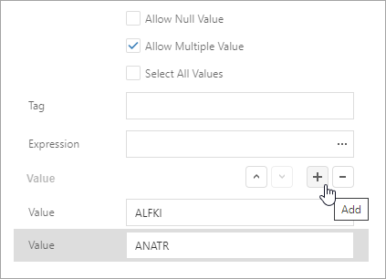
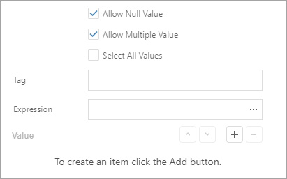
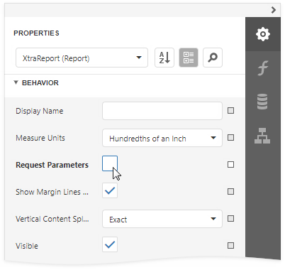
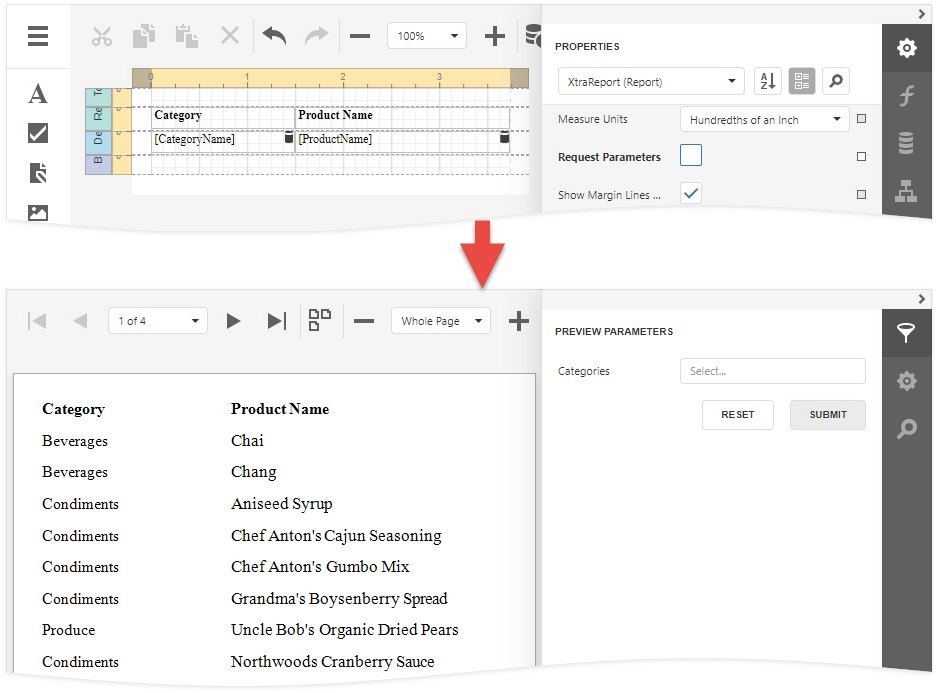

# Multi-Value Report Parameters

This document describes how to create a multi-value parameter and use this parameter to [filter report data](../shape-report-data/filter-data.md).



> [!TIP]
> Refer to this help article for information on how to use multi-value parameters in an SQL query: [Specify Query Parameters](../bind-to-data/specify-query-parameters.md#pass-a-multi-value-parameter-value-to-a-query).

## Create a Multi-Value Parameter in the Report Designer

Follow the steps below to create a multi-value parameter in the [Report Designer](../first-look-at-the-report-designer.md):

1. [Create a report parameter](create-a-report-parameter.md) and enable the **Allow multiple values** option.

    

1. Specify a list of predefined values for the parameter. You can create a static list of values or load values from a data source. Refer to the following topics for instructions on how to do it:

    * [Report Parameters with Predefined Static Values](report-parameters-with-predefined-static-values.md)
    * [Report Parameters with Predefined Dynamic Values](report-parameters-with-predefined-dynamic-values.md)

## Filter a Report's Data by a Multi-Value Parameter

To filter a report's data by a multi-value parameter, use the **Is any of** operator for this parameter in the report's [filter string](../shape-report-data/filter-data/filter-data-at-the-report-level.md):



## Specify Default Values for a Multi-Value Parameter

A multi-value parameter's default values are selected automatically when you open a report's **Print Preview**:


Use one of the following methods to specify default values:

* Click the *Add* button right to the **Value** option and specify a value in a new editor.

    

* Enable the **Select all values** property to populate the parameter value with all items from the parameter's value source (static or dynamic). 

    

> [!TIP]
> Disable a report's **Request Parameters** property to avoid the **Waiting for parameter values** message on the report's **Print Preview** and display the report with default parameter values.

> [!NOTE]
> Ensure that the type of default values match the parameter type when you specify these values for the parameter.

## Create an Optional Multi-Value Parameter

Optional parameters allow you to filter report data only if parameter values are specified. Otherwise, if parameter values are not set, the parameter is ignored.


Do the following to make a multi-value parameter optional.

1. Create a multi-value report parameter and specify its **Allow null value**, **Value**, and **Select all values** options as shown below:

    

    | Option | Value |
    | --- | --- |
    | **Allow null value** | **true** |
    | **Value** | Not specified |
    | **Select all values** | **false** |

2. Disable the report's **Request Parameters** property.

    

3. Assign the following filter condition to the report's filter string:

    ```
    ?category Is Null or [Category ID] In (?category)
    ```

    

    > [!TIP]
    > You can also use the filter string shown above to filter report data at the data source level. Refer to this help article for more information: [Filter Data at the Data Source Level](../shape-report-data/filter-data/filter-data-at-the-data-source-level.md).