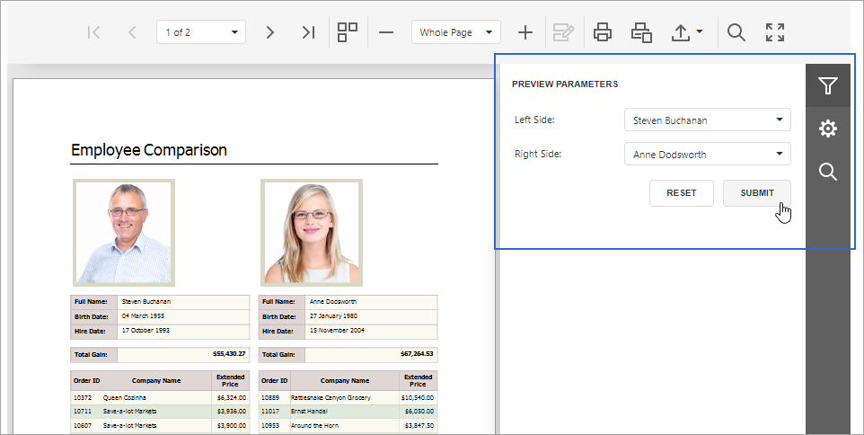
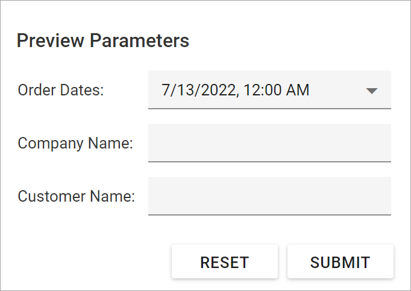

# The Parameters Panel

The **Parameters** panel allows you to specify parameter values in a report's **Print Preview**.

## Submit Parameter Values

When you open a report's **Print Preview**, the **Parameters** panel displays default parameter values and descriptions.

Specify parameter values and click **Submit** to generate the report's **Print Preview**. Set the report's **RequestParameters** property to **false** to display a report document for the default parameter values when you open the **Print Preview**.

## Reset Parameter Values to Defaults

Click the **Reset** button to reset parameter values to defaults. 

## Hide the Parameters Panel

To remove the **Parameters** panel from a report's **Print Preview**, disable the **Visible** option for all report parameters in the **Report Parameters Editor**.

When you hide the **Parameters** panel, the report's **Print Preview** is generated with the default parameter values.

## Customize the Parameters Panel

You can unite report parameters into expandable groups, place parameters side-by-side, add separators, and more.

| Default panel | Customized panel |
| ----------- | ----------- |
|  |  |

### Use the Report Parameters Editor

Right-click the **Parameters** node in the **Field List** and select **Edit Parameters**.

image goes here...

This action invokes the **Report Parameters Editor**.

image goes here...

Use the menu on the left to create and customize parameters, groups, and separators.

#### Customize a Parameter

Specify the **Label orientation** property to choose the position of a parameter label relative to an editor.

image1 goes here...

image2 goes here...

#### Create and Customize a Group

Click the **Add group** button to create a new group.

image goes here...

Use the **Up** and **Down** buttons to change the order of parameters and groups, and place parameters inside or outside a group.

image goes here...

You can also drag-and-drop parameters and groups inside the menu to achieve the same result.

image goes here...

To customize a group, select it and use its editors on the right to set up the group appearance. The following example unites the **customerName** and **companyName** parameters into a group called **Select a customer**.

image1 goes here...
image2 goes here...

Besides a title, you can also specify the following properties to customize the group appearance:

images go here...

#### Add a Separator

Click the **Add separator** button to create a separator.

image goes here...

Similar to parameters and groups, you can use the **Up** and **Down** buttons or drag-and-drop separators inside the menu to specify the location for these separators relative to other elements.

image goes here...

The example below shows the **Parameters** panel with a separator between the **Company Name** and **Customer Name** parameters.

images go here...