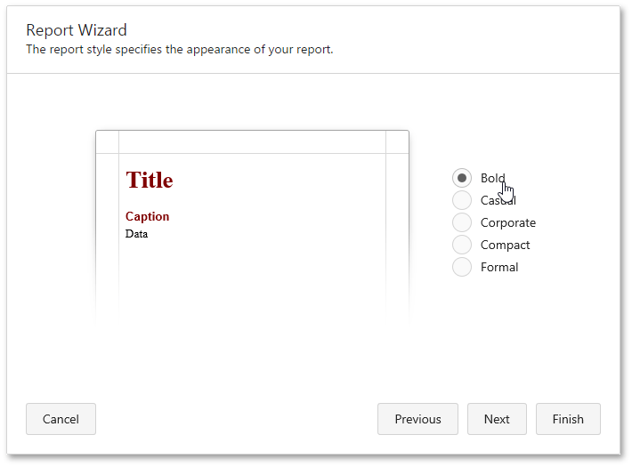

On this page, you can specify a visual style for the for the report.

You can stop the wizard at this step by clicking **Finish**. If you want to customize your report further, click **Next** to proceed to the next wizard page: [Specify the Report Title](../../../../../../interface-elements-for-web/articles/report-designer/wizards/report-wizard/data-bound-report/specify-the-report-title.md).