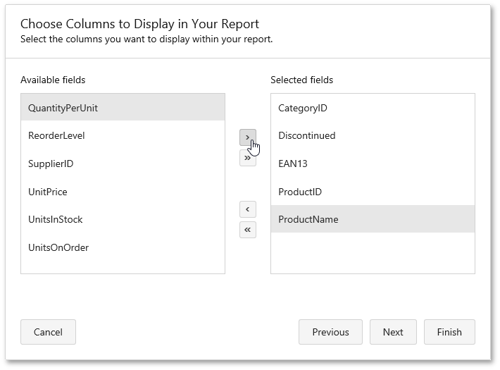

# Choose Columns
On this page, you can choose fields whose data will be displayed in your report. The selected fields and corresponding captions will be automatically added to the report body.

> To continue or finish report creation, you must select at least one field.

You can stop the wizard at this step by clicking **Finish**. If you want to customize your report further, click **Next** to proceed to the next wizard page: [Create Groups](create-groups.md).