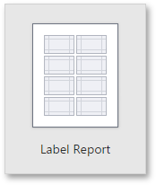

# Label Report
Selecting this option on the [Choose a Report Type](choose-a-report-type.md) wizard page will proceed to the Label Wizard that enables you to create labels of a required type.

The Label Wizard includes the following pages.
* [Choose the Label Type](label-report/choose-the-label-type.md)
* [Specify the Label's Parameters](label-report/specify-the-labels-parameters.md)

After completing the Label Report Wizard, you will get a blank report that generates labels of a particular size. The report designer will indicate the label boundaries and properly position labels on paper sheets. You can then populate the label area with the required content and print out your labels.