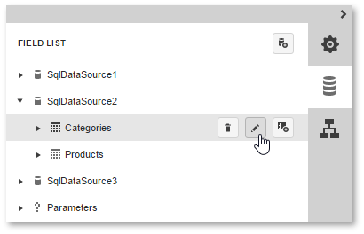

# SQL Data Source Wizard
Two different SQL Data Source Wizard versions are available, one to create a new data source and the other to edit an existing one.
* [Adding a New Data Source](../../../../interface-elements-for-web/articles/report-designer/wizards/sql-data-source-wizard/adding-a-new-data-source.md)
	
	To run the SQL Data Source Wizard to create a new data source, use the corresponding option in the [Report Designer Menu](../../../../interface-elements-for-web/articles/report-designer/interface-elements/menu.md).
	
	
	
	This menu command is only available if any data connections were explicitly provided to the Web Report Designer by your software vendor.
	
	The following is a complete list of wizard pages that may be required to create a new SQL data source.
	* [Choose a Data Connection](../../../../interface-elements-for-web/articles/report-designer/wizards/sql-data-source-wizard/adding-a-new-data-source/choose-a-data-connection.md)
	* [Create a Query or Select a Stored Procedure](../../../../interface-elements-for-web/articles/report-designer/wizards/sql-data-source-wizard/adding-a-new-data-source/create-a-query-or-select-a-stored-procedure.md)
	* [Configure Query Parameters](../../../../interface-elements-for-web/articles/report-designer/wizards/sql-data-source-wizard/adding-a-new-data-source/configure-query-parameters.md)
	* [Configure Master-Detail Relationships](../../../../interface-elements-for-web/articles/report-designer/wizards/sql-data-source-wizard/adding-a-new-data-source/configure-master-detail-relationships.md)
* [Editing an Existing Data Source](../../../../interface-elements-for-web/articles/report-designer/wizards/sql-data-source-wizard/editing-an-existing-data-source.md)
	
	To run the SQL Data Source Wizard to edit an existing data source, do one of the following.
	* To add a new query to an existing data source, select the data source and click the **Add Query** button in the [Field List](../../../../interface-elements-for-web/articles/report-designer/interface-elements/field-list.md).
		
		
	* To edit an existing query of a data source, select the query and click the **Edit Query** button in the [Field List](../../../../interface-elements-for-web/articles/report-designer/interface-elements/field-list.md).
		
		
	
	The following is a complete list of wizard pages that may be required to edit an existing SQL data source.
	* [Create a Query or Select a Stored Procedure](../../../../interface-elements-for-web/articles/report-designer/wizards/sql-data-source-wizard/editing-an-existing-data-source/create-a-query-or-select-a-stored-procedure.md)
	* [Configure Query Parameters](../../../../interface-elements-for-web/articles/report-designer/wizards/sql-data-source-wizard/editing-an-existing-data-source/configure-query-parameters.md)